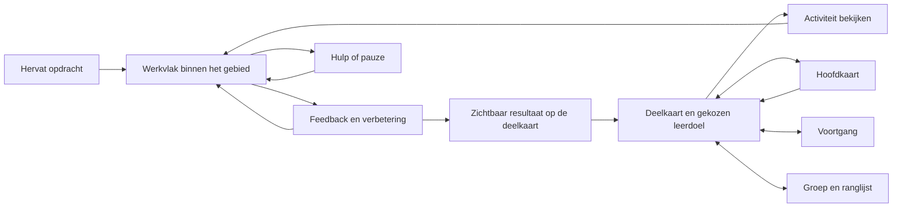

# Rechtenreis — spelraamwerk en schermontwerp

Actuele implementatie: [eerste leerlingversie met de kaart als start](rechten-leerlingenstart.md). Die vervangt de beperkte Kaartvallei-ingang door de vijf deelkaarten en letterlijke leerdoelen.

Ontwerpversie 2 · letterlijke namen en expliciete kaartstructuur · 22 september 2026.
Onderzoek geraadpleegd op 22 september 2026. De [kaartstructuur](rechten-wereld-leerroute.md) is leidend voor onderwerpindeling en stopplaatsen.

Dit is het voorstel voor de volledige spelervaring rond de bestaande vragenmotor.
De leerling kiest herkenbare leerdoelen op een getekende kaart en ziet wat het oefenen oplevert.
De hoofdkaart Rechten is de thuisbasis; activiteiten spelen zich af binnen een onderwerp.
De leerplanner levert daarbij nieuwe begrippen, herhaling, herstel en transfer.

Bij dit document hoort een [klikbaar schermmodel](rechten-gameframe/index.html).
Het gebruikt uitsluitend fictieve ontwerpgegevens, bewaart niets in accounts en
wijzigt de trainer niet. Het toont de samenhang van schermen; het is geen nieuwe
volledige wiskundige implementatie. De eerdere Kaartvallei-integratie blijft een
afzonderlijke technische proef, niet het vastgelegde eindontwerp.

## 1. Wat het onderzoek toevoegt

| Bron / soort bewijs | Bevinding of zichtbaar productpatroon | Vertaling naar ons ontwerp |
| --- | --- | --- |
| [Hunicke, LeBlanc & Zubek — MDA, 2004](https://www.cs.northwestern.edu/~hunicke/MDA.pdf), ontwerpkader | Verbind concrete spelregels, het gedrag dat daarmee ontstaat en de beleving van de speler. Begin ook vanuit de gewenste ervaring. | Eerst ontdekken, iets kunnen en keuzes maken beschrijven; daarna pas knoppen, punten en kaarten kiezen. |
| [Sailer & Homner — meta-analyse, 2020](https://link.springer.com/article/10.1007/s10648-019-09498-w), onderzoekssynthese | Gemiddeld positieve effecten op leren; effecten verschillen tussen studies. Motivatie- en gedragseffecten waren minder stabiel in de analyse van methodologisch sterkere studies. | Een spelvorm kan helpen, maar deze specifieke reis moet met leerlingen worden beproefd. Speeltijd en XP zijn geen bewijs van leren. |
| [Habgood & Ainsworth — intrinsieke integratie, 2011](https://tecfa.unige.ch/tecfa/teaching/BSEP/articles/Habgood_Ainsworth_2011.pdf), twee studies bij kinderen | In hun rekenspel hielp verwevenheid tussen leerinhoud en spelhandelingen. De onderzochte doelgroep en rekentaken verschillen van onze trainer. | Laat een correcte constructie waar mogelijk een echte verbinding op de kaart maken. Een bestaand vraagtype mag eerst in een werkvenster blijven, maar krijgt een begrijpelijk doel en zichtbaar gevolg. |
| [Duolingo — uitleg van het padontwerp, 2022](https://blog.duolingo.com/new-duolingo-home-screen-design/), productbeschrijving | Het beschreven pad mengt begrippen en bouwt oefening in de route in. De leerling hoeft niet zelf alle herhaling te plannen. | Bestemming kiezen kan; herhaalmomenten blijven door de leerplanner verzorgd. We kopiëren geen volledig lineair pad. |
| [Prodigy — productuitleg](https://www.prodigygame.com/main-en/blog/what-is-prodigy-math-game), productbeschrijving | Gebieden, personages, opdrachten en beloningen vormen een spelcontext rond wiskundige oefening. | Ontwerp een doorlopende wereld met terugkerende gebeurtenissen. Dit is een inspiratiebron voor structuur, geen onafhankelijk bewijs van leereffect. |
| [Khan Academy — Mastery Challenges](https://support.khanacademy.org/hc/en-us/articles/360037494231-What-are-Mastery-Challenges), productbeschrijving | Gepersonaliseerde herhaalvragen combineren eerder behandelde skills uit de cursus; dezelfde skill komt niet noodzakelijk onmiddellijk achter elkaar. | Gemengd herhalen en gewone oefenreeksen mengen eerdere inhoud. Wereldvoltooiing betekent niet dat de onderliggende vaardigheden verdwijnen. |
| [Almeida e.a. — negatieve effecten van gamification, 2023](https://arxiv.org/abs/2305.08346), systematische mapping | De geselecteerde literatuur rapporteert ook ongewenste effecten van punten, badges, competitie en ranglijsten. Het onderzoek schat niet de kans dat iedere toepassing daarvan mislukt. | Sociale vergelijking krijgt een afzonderlijke, vrijwillige plek. De persoonlijke leerroute hoeft niet gewonnen te worden van klasgenoten. |
| [Xbox XAG 112 — navigatie](https://learn.microsoft.com/en-us/xbox/accessibility/xbox-accessibility-guidelines/112), praktijkrichtlijn | Consistente bediening, voorspelbare volgorde en terugnavigatie helpen spelers door meerdere schermen. | Een vaste terugknop, herkenbare schermhiërarchie en steeds dezelfde plaats voor de hoofdactie. |
| [Xbox XAG 113 — focus](https://learn.microsoft.com/en-us/xbox/accessibility/xbox-accessibility-guidelines/113), praktijkrichtlijn | Focus moet duidelijk zichtbaar blijven, ook bij vensters boven een ander scherm. | Selectie en toetsenbordfocus hebben een duidelijke omlijning; een geopend venster houdt focus binnen dat venster en geeft haar daarna terug. |
| [Xbox XAG 117 — beweging](https://learn.microsoft.com/en-us/xbox/accessibility/xbox-accessibility-guidelines/117), praktijkrichtlijn | Beweging achter tekst en automatisch veranderende inhoud kunnen storen; geef controle over zulke effecten. | Rustige tekenstijl, korte overgangen, geen voortdurend bonzende locaties; verminderde beweging respecteren. |

De onderstaande concrete spelregels zijn onze ontwerpkeuzes en toetsbare
hypothesen. Geen van deze bronnen bewijst dat precies vijf gebieden, drie
aanbevelingen of een bepaald aantal sterren optimaal is voor onze leerlingen.

## 2. Spelbelofte en dynamiek

**Je ontdekt rechten via een kaart met herkenbare wiskundige leerdoelen.**
De omgeving mag als een reis aanvoelen. De leerling hoeft geen verhalende rol aan
te nemen: namen, knoppen en feedback benoemen rechtstreeks de wiskunde en de actie.
Een getekend landschap en zichtbare voortgang geven het spel karakter.

| Gewenste ervaring | Wat de leerling daadwerkelijk doet | Reactie van het spel |
| --- | --- | --- |
| Nieuwsgierigheid | Een herkenbaar maar nog onbekend gebied bekijken | Een korte vooruitblik, één concreet doel en zichtbare voorbereiding |
| Keuze | Kiezen tussen een aanbevolen opdracht, een passende andere gebeurtenis of oefenen | De bestemming verandert de context; noodzakelijke herhaling reist mee |
| Bekwaamheid | Een punt plaatsen, een model bouwen, een fout verbeteren | De eigen constructie blijft zichtbaar; een bruikbaar onderdeel van de wereld verandert |
| Eigenaarschap | Een embleem kiezen en een eigen voortgangsoverzicht vullen | De wereld en het profiel dragen blijvende sporen van de reis |
| Verbondenheid | Aan een gezamenlijk project bijdragen, desgewenst aan een uitdaging deelnemen | Een gedeeld resultaat of vergelijkbare wedstrijdscore onder alias |

We beginnen met klikken/tikken op plaatsen en een reizigerssymbool dat tussen
betekenisvolle locaties beweegt. Vrij rondlopen met botsingen, een joystick en
zoekwerk is een andere spelvorm en zou eerst apart moeten bewijzen dat het helpt.
Verplaatsen kost geen energie, levens of oefenkansen. Een fout maakt geen gebouw
kapot en neemt geen eerder verdiende decoratie weg.

## 3. Drie ritmes die samen één spel vormen

**Per handeling:** richten → uitvoeren → onmiddellijk begrijpen wat klopt →
verbeteren of bevestigen. Een verkeerde b verwijdert geen correcte a. Een fout
geeft inhoudelijke feedback op het werkvlak; hij leidt niet naar een los strafscherm.

**Per etappe:** bestemming kiezen → een oefenreeks → herhaling van
eerder geleerde inhoud → een toepassing → een zichtbare verandering en een rustige
afronding. De twaalf huidige primaire opgaven kunnen eerst behouden blijven,
verdeeld over betekenisvolle gebeurtenissen. Er is geen verplichte kaartklik na
elke vraag. De duur van lange constructies moet worden gemeten; twaalf opgaven is
nog geen betrouwbare tijdsbelofte. Stoppen en later hervatten kan tussen stappen.

**Over meerdere etappes:** routes ontdekken → eerder werk in nieuwe situaties
gebruiken → een onderwerptoets afronden → elders verder reizen → later terugkomen
met een andere opdracht. De wereld groeit, terwijl beheersing opnieuw wordt getoetst.

## 4. Wereldhiërarchie en schermen

**Hoofdkaart Rechten → deelkaart per onderwerp → stopplaats met leerdoel → activiteit.**
Er zijn twee kaartniveaus. Een stopplaats opent een detailpaneel, geen derde kaart.
De vijf voorgestelde onderwerpen hebben samen veertien stopplaatsen; de volledige
indeling en alle 27 skill-IDs staan in de [kaartstructuur](rechten-wereld-leerroute.md).
Oefenen, extra variatie, gemengd herhalen en een onderwerptoets zijn activiteiten.
Voortgang, groep/ranglijst en profiel zijn aanvullende schermen, geen kaartgebieden.

| Scherm | Hoofdvraag van de speler | Inhoud en hoofdactie | Terugkeer |
| --- | --- | --- | --- |
| Binnenkomst | Waar was ik? | Alias/embleem, **Hervat opdracht**, klein overzicht van de vorige ontdekking | Hervat exact het lopende werk; nieuwe spelers zien een korte eerste ontdekking |
| Hoofdkaart | Waar kan ik heen? | Vijf gebieden, eigen positie, aanbevolen bestemming, bereikbare alternatieven | Vanuit een deelkaart terug met hetzelfde gebied geselecteerd |
| Deelkaart | Wat kan ik hier doen? | Twee tot vier stopplaatsen met letterlijke leerdoelen, selectie en activiteitenpaneel | Behoud positie, selectie en lokale wereldveranderingen |
| Gebeurtenisvoorstel | Wat ga ik doen en waarom? | Doel, verwachte soort activiteit, beschikbare hulp, mogelijke wereldverandering; **Begin** | Sluiten start niets en verliest niets |
| Werkvlak | Hoe los ik dit op? | Bestaande grafiek-/breuk-/constructiecontrols, compacte opdracht, uitleg en herstel | **Pauzeer** bewaart taak, deelstappen en plaats; hervatten is direct bereikbaar |
| Afronding | Wat heb ik bereikt? | Zichtbare verandering op de deelkaart, korte samenvatting, eventueel verdiend embleem; **Terug naar deelkaart** | Blijf in hetzelfde gebied; geen automatische sprong naar de hoofdkaart |
| Voortgang | Wat heb ik ontdekt en wat komt terug? | Ontdekkingen, eigen voorbeelden, geplande herhaling en begrijpelijke voortgang | Exact naar de vorige plek/opgave |
| Groep | Wat doen we samen? | Gezamenlijk project; aparte tab voor een vergelijkbare uitdaging en ranglijst | Deelname vervangt de persoonlijke etappe niet |
| Profiel en instellingen | Wie ben ik in dit spel? | Alias, embleem, verdiende illustraties, beweging/geluid, accountstatus | Geen verlies van werk bij een cosmetische keuze |

Vaste primaire navigatie: **Kaart · Voortgang · Groep · Profiel**. Binnen een
gebied blijven **Terug naar hoofdkaart** en **Hervat opdracht** dichtbij. Tijdens
een opgave krijgt de taak de meeste ruimte; secundaire schermen pauzeren die
opgave. De platformlink naar leraarBob blijft een afzonderlijke, herkenbare bestemming.

## 5. Contract voor scherminteracties

| Actie/toestand | Zichtbare reactie | Wat moet behouden blijven? |
| --- | --- | --- |
| Hover of focus | Dunne omlijning en duidelijk label; nooit informatie die uitsluitend bij hover bestaat | De huidige selectie |
| Plaats selecteren | Eén actieve highlight; details openen naast of boven de kaart | Selecteren start geen taak |
| Beginnen | Reiziger verplaatst; kaartdetail wordt werkvlak of ondergrond van een taakvenster | Gebied, positie, missie-ID en taak-ID |
| Juist antwoord | Korte accentreactie bij het relevante onderdeel; feedback blijft leesbaar | Juiste deelstappen; beloning wordt eenmaal verwerkt |
| Fout antwoord | Markeer wat onderzocht moet worden; leg de fout uit; laat verbeteren | Correct werk, bestaande toegang en eerdere prestaties |
| Uitleg | Voorbeeld in een duidelijk hulpvenster | Het eigen antwoord; zelfstandigheidsstatus wordt apart bijgehouden |
| Terug/Escape | Eén niveau terug; een pauze hervat hetzelfde werk | Geen nieuwe willekeurige vraag en geen reset |
| Vergrendelde gebeurtenis | Inspecteerbaar doel met concrete ontbrekende voorbereiding | Andere bestaande routes blijven toegankelijk |
| Geen nieuwe opdracht nodig | Bied onderhoud, een passende variant of vrij oefenen | Geen geforceerde herhaling voor kunstmatig meer speeltijd |
| Opslag onderweg/offline | Kleine, begrijpelijke status; persoonlijk oefenen kan verder waar de bestaande opslag dat ondersteunt | Geen dubbele beloning; wedstrijdinzending wacht op bevestiging |
| Accountwisseling | Oude oefening sluiten en nieuwe accountstate laden | Geen reis of alias van de vorige leerling meenemen |

Beginwaarden voor prototyping: selectiefeedback direct, verplaatsing ongeveer
200–350 ms, een wereldverandering ongeveer 400–700 ms. Dit zijn te testen
ontwerpwaarden. Met verminderde beweging wordt dezelfde verandering direct getoond.
Afsluiten van een uitlegvenster herstelt de focus op de knop die het opende.

## 6. Gebieden en gebeurtenissen

De vijf deelkaarten zijn **Punten en helling**, **Eigenschappen van rechten**,
**Voorschriften opstellen**, **Tabellen, grafieken en toepassingen** en
**Nulwaarden en tekens**. Elke stopplaats heeft een concreet leerdoel, bijvoorbeeld
**Helling uit twee punten**. Visuele landschappen mogen verschillen zonder aparte
verhaalnamen. Deze indeling is een te beoordelen voorstel, geen nieuwe skillvolgorde.

De 27 skill-IDs en hun betekenis blijven leidend. `slope_from_two_points` blijft
vroeg; herleiden blokkeert b uit a en een punt niet. `information_sufficiency`
blijft een latere, niet-blokkerende uitbreiding. Een deelkaart hoeft niet volledig
afgerond te zijn voordat elders een reeds beschikbare opdracht kan starten.

Bij **Helling uit twee punten** kan eerst een gehele helling aan bod komen en later
een negatieve fractionele helling. Dezelfde kennis komt terug bij **Voorschrift
uit een situatie**. Geplande herhaling wordt in gewone oefenreeksen ingebouwd;
**Gemengd herhalen** biedt daarnaast een vrijwillige extra ingang. Een stopplaats
is de thuisplek van een leerdoel, geen afgesloten verzameling vragen.

Een onderwerptoets combineert nieuwe en eerdere kennis met expliciete dekking.
Afgeronde delen blijven bewaard; ontbrekend bewijs krijgt gerichte voorbereiding
en een herkansing met nieuwe gegevens. Het project is persoonlijk. Een
ranglijstwedstrijd heeft een eigen, vergelijkbare opzet.

## 7. Beloningen zonder een tweede leeradministratie

| Laag | Wat de leerling ziet | Regel |
| --- | --- | --- |
| Handeling | Correct punt, passend lijnstuk, begrijpelijke terugmelding | Direct gevolg van de eigen invoer; geen confetti na elke klik |
| Gebeurtenis | Constructie zichtbaar, afgeronde reeks gemarkeerd, resultaat toegevoegd | Eenmalig zichtbaar resultaat van voltooiing; met hulp voltooien mag zichtbaar resultaat opleveren |
| Reis | Embleem, andere vlag of kleine illustratie voor het voortgangsoverzicht | Cosmetisch; geeft geen rekenvoordeel of toegang tot hulp |
| Leren | ‘Zelfstandig gelukt’ en later ‘opnieuw aangetoond’ | Afgeleid van echte leerbewijzen, los van cosmetische voltooiing |
| Bestaande XP | Bescheiden voortgangsindicatie in het profiel | De trainer blijft de enige bron; geen tweede XP-teller of bonus per wereldklik |

Aanbeveling voor versie 1: één voltooiingsster per gebeurtenis en een afzonderlijk
bewijslabel. Geen drie sterren die tegelijk tijd, fouten, inspanning en mastery
proberen te betekenen. Reeds verdiende sterren blijven; latere oefenbehoefte
verschijnt als een uitnodiging tot onderhoud. We starten zonder extra munten,
winkel, willekeurige buit of dagelijkse verliesstraf. Eerst testen of wereldgroei,
keuze en een kleine verzameling genoeg betekenis geven.

## 8. Aliassen, samen spelen en ranglijsten

Aliassen passen bij de bestaande accountlaag. Toon een alias en gekozen embleem.
Een alias maakt klasgenoten niet noodzakelijk onherkenbaar. Het voorstel begint
daarom bij de eigen klas/groep, met een vrijwillige competitietab; persoonlijke
fouten, herstelbehoefte en mastery verschijnen daar niet als openbare vergelijking.

**Standaard bij Groep:** een gezamenlijk project, bijvoorbeeld een atlasplaat
aanvullen. Een afgeronde, door de planner gekozen etappe kan één bijdrage geven,
ook als een leerling hulp gebruikte. Een voorstel voor de eerste proef is maximaal
drie bijdragen per leerling per project: extra oefenen blijft mogelijk, maar één
veelspeler kan het hele project niet alleen vullen. Dit aantal is nog te kalibreren.

**Ranglijst:** uitsluitend een specifieke uitdaging met dezelfde inhoudsopzet,
hetzelfde niveau en dezelfde scoringsregels. De adaptieve persoonlijke route
geeft verschillende taken aan verschillende leerlingen; ruwe XP is daarvoor geen
zuivere prestatievergelijking.

Concrete eerste wedstrijdopzet, nog een ontwerp:

- Twaalf primaire opgaven uit een vast gepubliceerde verdeling; iedereen in deze
  wedstrijd speelt dezelfde versie. Een ander niveau heeft een eigen ranglijst.
- Score 0–12: één punt voor een primaire opgave die bij de eerste beoordeling
  zelfstandig juist is. Een meerstappenopgave blijft één primair onderdeel.
- Hulp blijft beschikbaar; het betreffende onderdeel levert dan geen wedstrijdpunt
  op. Oefenen en leren gaan verder zonder een leerling uit de opdracht te zetten.
- Eén tellende poging per editie. Daarna onbeperkt oefenen buiten de ranglijst.
- Gelijke scores krijgen dezelfde plaats. Tijd is geen verborgen beslisser.
- Geen rangdaling door het missen van een dag. Een afgesloten editie blijft als
  resultaat staan; een volgende editie begint voor iedereen opnieuw.
- Resultaten worden door de server gecontroleerd. Lokale XP of een door de browser
  aangeleverd totaal is geen betrouwbare wedstrijduitslag. Bestaande groepsdiensten
  kunnen accountbinding en sessies leveren, maar valideren deze nieuwe quiz nog niet.

Verschillende gegenereerde varianten zijn niet vanzelf even moeilijk. De eerste
proef gebruikt daarom één vastgestelde set in een afgesproken sessie; gedeelde
antwoorden en vergelijkbaarheid moeten bij later asynchroon gebruik apart worden
behandeld. Zo'n ranglijst meet deze uitdaging, niet ‘wie het best is in wiskunde’.

## 9. Visuele taal en schaalbaarheid

Sober getekende kaart: warm wit papier, donkere inkt, een grijsgroene landschapstoon,
groen voor actuele selectie en goud voor behaalde mijlpalen. Gebieden verschillen
door silhouet en bouwvorm, niet door vijf felle achtergrondkleuren. Tekst gebruikt
een heldere gewone letter; gebiedstitels mogen een rustige boekletter krijgen.

De hoofdkaart gebruikt grotere vormen en weinig labels. De deelkaart heeft
herkenbare gebouwen, een reizigerssymbool en een kleine actuele route. Het
werkvlak mag strakker zijn: een rooster, exacte maten en duidelijke controls.
Decoratieve bergen zijn geen meetgegevens. Bij een wiskundige kaartopdracht
zijn assen, schaal en relevante punten expliciet zichtbaar.

Op desktop krijgt de kaart een begrensde leesbreedte en schalen de landmarks
mee: voldoende grote locaties en leesbare leerdoelen. Op mobiel staat het detailpaneel
onder de kaart of wordt het een volwaardig taakscherm met dezelfde plaatsaanduiding.
Menu's en kaarten moeten ook rechtop leesbaar zijn; een bestaande constructie kan
voorlopig liggend gebruik nodig hebben. Belangrijke acties blijven bereikbaar via
normale scroll als de beschikbare hoogte te klein is, in plaats van af te snijden.

Eigen ontwerpdoel: bediening minimaal 48×48 CSS-pixels, zichtbare focus,
tik-alternatief voor slepen, geen native toetsenbord nodig om wiskunde in te voeren.
Fysieke toetsenbordbediening voor navigatie blijft juist ondersteund. Betekenis
wordt ook door labels en vormen gedragen; kleur en geluid zijn aanvullend.

## 10. Grens tussen spel en leerengine

De bestaande generator, antwoordcontrole, diagnose, herhaalplanning en skillstate
blijven de inhoudelijke bron. Daarboven komen vier kleine verantwoordelijkheden:

1. **Wereldgegevens:** gebieden, plaatsen, gebeurtenissen en zichtbare gevolgen.
2. **Reisregie:** kiest samen met de leerplanner een passende gebeurtenis en bewaart
   waar de speler was. Een gekozen gebied is een voorkeur, geen gesloten skilllijst.
3. **Schermregie:** terugnavigatie, selectie, taakvenster, pauze, focus en hervatten.
4. **Presentatie van resultaten:** verwerkt één bevestigd pogingresultaat tot
   wereldverandering, bewijslabel en eventuele cosmetische ontdekking.

Minimaal resultaatcontract: `attemptId`, primaire `skillId`, `taskId`,
`independent`, `completed`, foutcodes, bestaande XP-mutatie en door de leerengine
vastgelegde bewijsverandering. De wereld leidt geen zelfstandigheid af uit alleen
‘uiteindelijk juist’. Een eenmalige wereldbeloning heeft daarnaast een eigen
stabiele gebeurtenis-ID. Deelstappen tellen niet nogmaals als losse vaardigheidsscores.

Scheid taakstate, leerstate, persoonlijke wereldstate en wedstrijdstate. Herladen,
accountwisseling en mislukte opslag mogen geen score dupliceren of een gedeeltelijk
antwoord wissen. Een nieuwe game-engine, 3D-renderer of multiplayerwereld is voor
dit raamwerk niet nodig; de bestaande webtechniek met SVG is een passende eerste stap.

## 11. Bouwvolgorde en beslismoment

**Nu:** dit ontwerp en het klikbare schermmodel. Beoordeel de volledige ervaring:
waar start je, hoe kies je, wat verandert, waar vind je hulp en wat doet het groepsscherm?

**Daarna:** één volledige spelcyclus koppelen: hoofdkaart → deelkaart → echte gebeurtenis
met bestaande controls → wereldverandering → later terugkerende oefening. Neem
hervatten en verlies van verbinding meteen mee. Bouw niet eerst alle decoraties.

**Vervolgens:** voortgangsoverzicht, enkele cosmetische ontdekkingen, één onderwerptoets en
een gezamenlijk project. Pas na een kleine proef de eerste ranglijst toevoegen,
met echte servercontrole en een geteste gelijke wedstrijdopzet.

**Pas daarna:** de overige gebieden vullen met dezelfde schermregels. Extra
verhaal, personages en een groter beloningssysteem volgen alleen als ze iets
toevoegen aan de gemeten spel- en leerervaring.

Proef met bijvoorbeeld vijf tot acht leerlingen van verschillende niveaus:
laat zonder uitleg een bestemming kiezen, een fout verbeteren, hulp openen,
pauzeren, terugkomen en de betekenis van een ster uitleggen. Meet navigatietijd,
gemiste bediening, hervatfouten en of leerlingen het wereldgevolg begrijpen.
Controleer daarnaast zelfstandige prestaties bij latere herhaling; meer klikken,
langere speeltijd of meer verdiende punten bewijzen op zichzelf geen leerwinst.

Open ontwerpkeuzes om tijdens die proef te beoordelen: begrijpelijkheid van de indeling en
leeftijdstoon, hoeveel reisanimatie prettig is, aantrekkelijkheid van emblemen,
de lengte van etappes en de wens om vrijwillig aan de groepsactiviteiten mee te doen.

## 12. Het schermmodel bekijken

Open `docs/rechten-gameframe/` via de lokale server. Probeer achtereenvolgens:
een gebied selecteren → deelkaart openen → Helling uit twee punten selecteren → Oefenen kiezen → de voorbeeldlus starten → een fout
maken → verbeteren → uitleg bekijken → pauzeren → via het profiel een embleem
kiezen → dezelfde opdracht hervatten → afronden → de nieuwe verbinding en
voortgangsoverzichtnotitie bekijken → het groepsscherm openen.

Alle vijf onderwerpen hebben een inspecteerbare deelkaart. Alleen Helling uit twee punten heeft
een uitgewerkte interactielus, met één vaste opgave in twee stappen. De overige
activiteiten tonen hun bedoelde functie; ze zijn nog geen aparte vraagreeksen.
De ranglijst, groepsstand en alias zijn nadrukkelijk voorbeelddata. Herladen wist
de lokale demonstratie; er wordt geen browseropslag of accountopslag gebruikt.

Alle veertien stopplaatsen en hun activiteitkeuzes zijn gecontroleerd. De
inhoudsindeling bevat 27 unieke skill-IDs. De schermovergangen en voorbeeldlus zijn
in Chromium gecontroleerd op 1440×900,
1100×700, 640×360 en 390×844. Foutfeedback, hulpvenster, hervatten van dezelfde
stap, wereldverandering, voortgangsoverzicht, ranglijstkeuze, embleem en verminderde beweging
werken. Geen horizontaal afgesneden bediening; smalle schermen mogen verticaal
scrollen. JavaScript-syntaxcontrole en `git diff --check` slagen. De bestaande
trainercode, leerstate, catalogus en online ranglijsten zijn niet gewijzigd.
