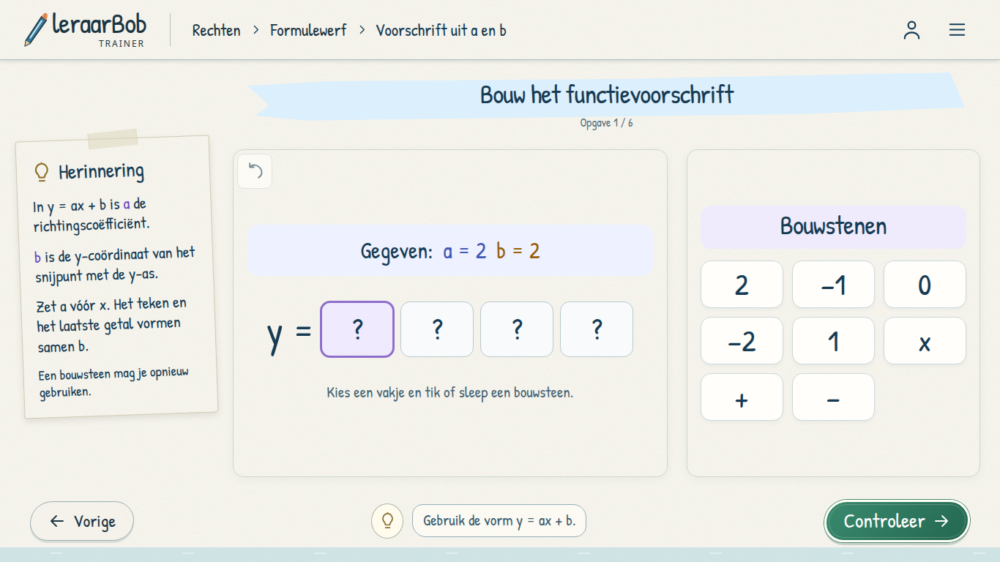
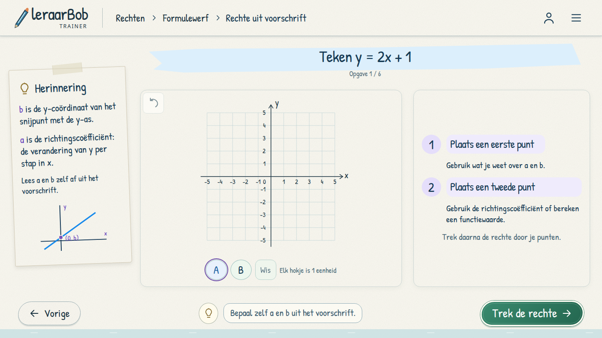
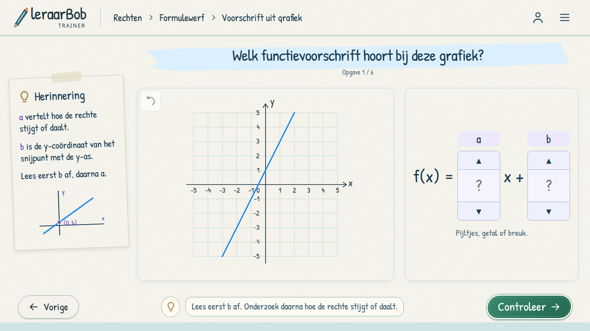
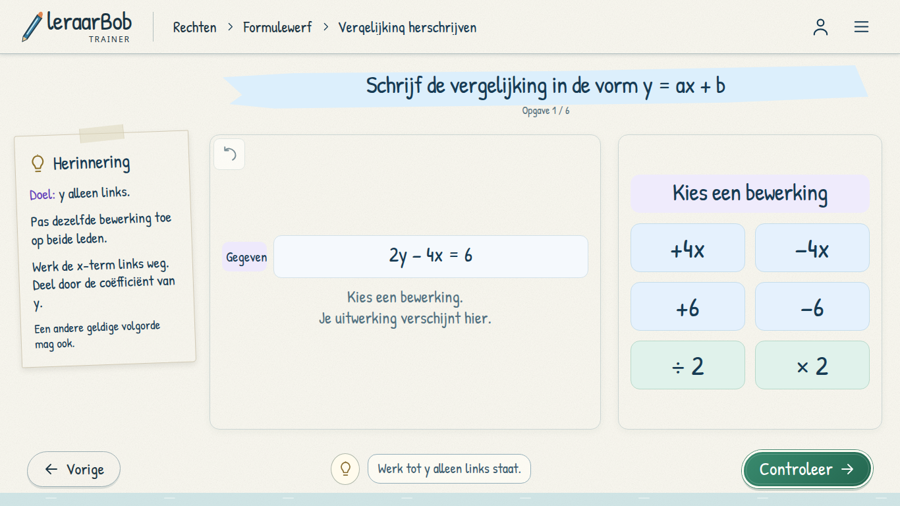
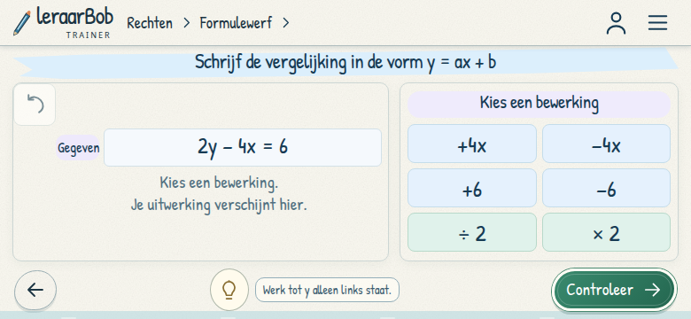

# Formulewerf A — vier speelbare haltes

Open `games/rechten/trainer-v2/#formulewerf/bouwen`. De vier bestaande haltes
hebben elk zes opgaven en bewaren hun voortgang afzonderlijk.

| Halte | Bediening |
| --- | --- |
| Voorschrift uit a en b | Kies een vakje en tik of sleep een bouwsteen. Getallen mogen opnieuw worden gebruikt. |
| Rechte uit voorschrift | Selecteer A/B en plaats twee verschillende punten via klikken, slepen, touch of pijltjestoetsen. Trek daarna de rechte. |
| Voorschrift uit grafiek | Vul a en b in met de pijltjes of typ een getal, decimaal of breuk. |
| Vergelijking herschrijven | Kies een bewerking op beide leden en controleer wanneer y alleen links staat. |

De tekenopdracht begint bij `y = 2x + 1`. De hulp legt a en b algemeen uit;
er staan geen antwoordcoördinaten, ingevulde coëfficiënten of vooraf getekende
hulppijlen op het rooster. Alleen zelf geplaatste punten en hun verbindingslijn
verschijnen. Elk paar verschillende punten op de gevraagde rechte is geldig.

De reeksen bevatten positieve, negatieve, halve en nulcoëfficiënten. De grafiek
bij aflezen heeft een zichtbare y-afsnede en eenvoudige helling. Algebra bewaart
de daadwerkelijk uitgevoerde stappen; ook eerst delen is geldig. Ongedaan maken
is beschikbaar. Getallen worden exact als rationale getallen vergeleken via de
bestaande validators. Bij herstel blijven correcte formuleonderdelen, parameters
of punten staan. Voltooien vereist expliciete controle en zes juiste opgaven.

Implementatie: `formula-core.js`, `components/formula-view.js`, `styles/formula.css`,
met aansluitingen in runtime, app-shell, kaarten en header. Geen nieuw
opslagformaat, nieuwe skill-ID's of masteryregels. Werkplaats B behoudt zijn
bestaande voorvertoningen. De herinnering bij tekenschema's zonder grafiek blijft
naar de richtingscoëfficiënt, de coëfficiënt van x, verwijzen.

## Controle

```sh
node --test tests/rechten-*.test.cjs tests/catalog*.test.cjs
V2_SCREENSHOT_DIR=/tmp/formulewerf-a node tests/rechten-v2-formula-a-browser.cjs
V2_SCREENSHOT_DIR=/tmp/formulewerf-map node tests/rechten-v2-formulewerf-browser.cjs
```

De nieuwe browsertest gebruikt een geïsoleerde Chromium, lokale server en
fictieve gast. Hij doorloopt alle vier de reeksen, correcte en foute antwoorden,
slepen met muis/touch, toetsenbord, ongedaan maken, hervatten na herladen,
herhaling, hints en scherm draaien. 68 layoutcontroles op 1920×1080, 1366×768,
1024×768, 780×360 en 640×360. De rekentests tellen samen 164 geslaagde tests.
De Formulewerf-kaarttest slaagt met 57 layoutcontroles; de bestaande
puntenbediening slaagt met 80 controles, inclusief samenvallende punten.






