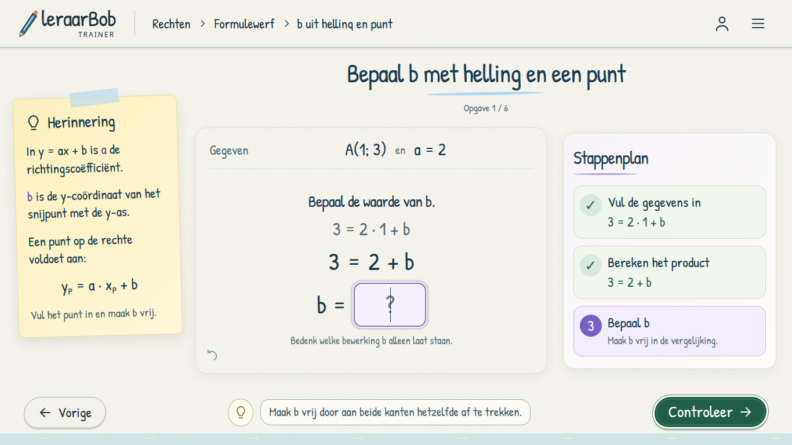
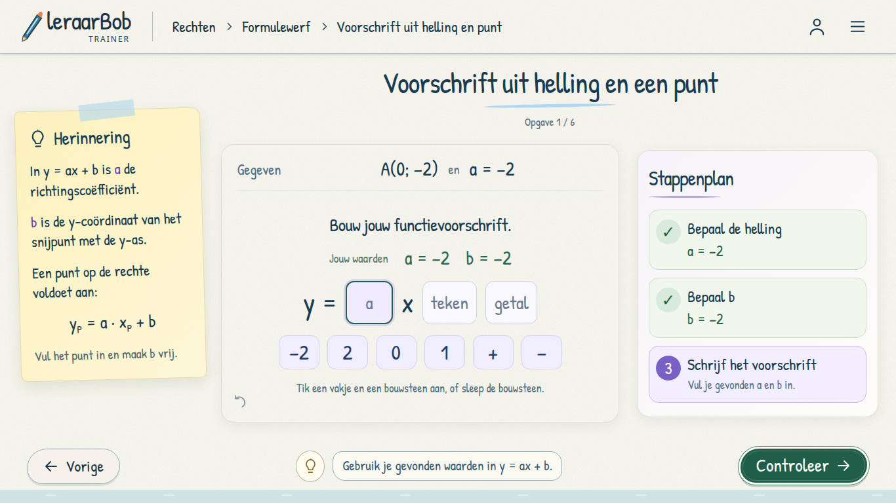
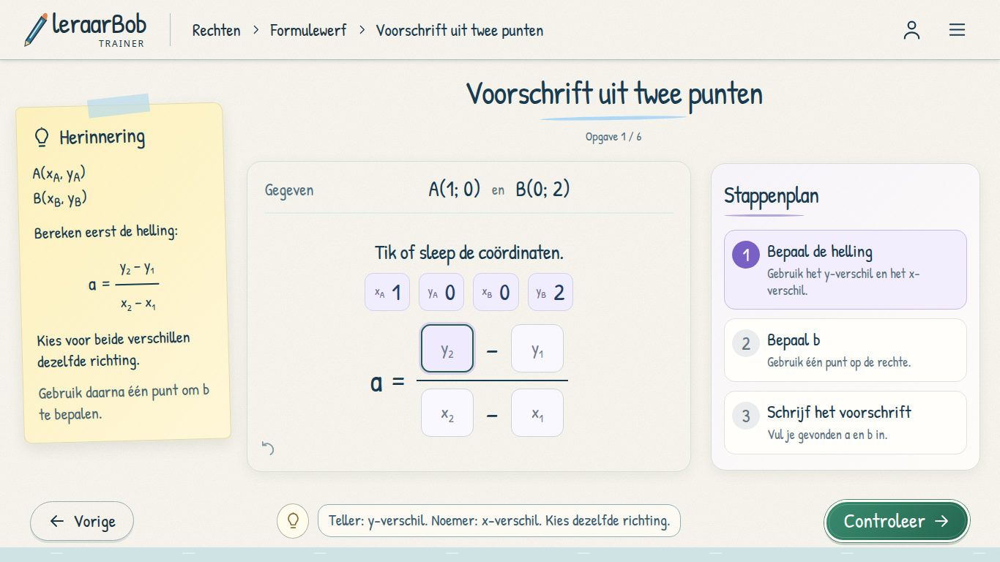
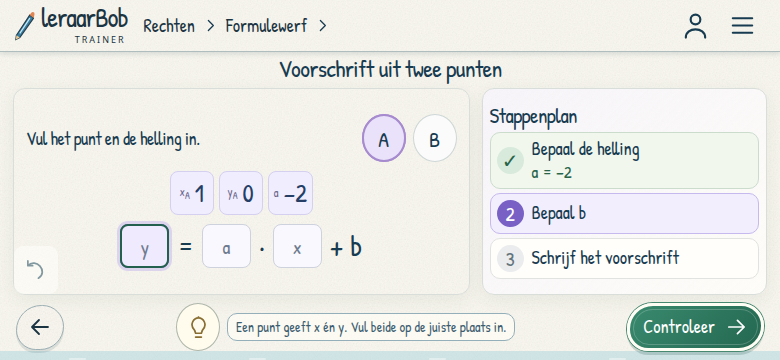

# Formulewerf B — afleiden met punten

Route: `games/rechten/trainer-v2/#formulewerf/omzetten`.
De drie aangeleverde werkbladen zijn speelbare haltes, elk met zes opgaven:

| Halte | Opbouw |
| --- | --- |
| b uit helling en punt | x, y en a invullen → product berekenen → b bepalen |
| Voorschrift uit helling en punt | Dezelfde berekening → voorschrift samenstellen met het juiste teken |
| Voorschrift uit twee punten | Coördinatenbreuk opbouwen → a berekenen → punt kiezen → b berekenen → voorschrift samenstellen |

De mockups zijn richtinggevend gebruikt. Het eindantwoord staat niet vooraf in
het stappenplan. Een ingevulde formule of berekening verschijnt daar pas na
controle. Bij twee punten zijn beide consistente aftrekvolgordes en beide
punten voor de berekening van b toegestaan. Coördinaatbouwstenen benoemen hun
punt en as, zodat gelijke getallen niet tot dubbelzinnige invulvakken leiden.

De herinnering beschrijft b als de **y-coördinaat** van het snijpunt met de y-as.
Negatieve getallen in producten en verschillen krijgen haakjes. Getallen worden
exact vergeleken; equivalente breuken en decimalen zijn geldig. De reeksen
bevatten negatieve hellingen, horizontale rechten, halve coördinaten en punten
op de y-as. De laatste stap normaliseert bijvoorbeeld `−2x + (−2)` tot `−2x − 2`.

De leerling kan tikken, slepen met muis/touch en het toetsenbord gebruiken.
Correcte invulvakken blijven staan na herstel. Wisselen van punt wist alleen de
puntgebonden substitutie; een al berekende helling blijft bewaard. Ongedaan
maken, pauzeren, herladen en herhalen gebruiken de bestaande opslag.

Op desktop staan herinnering, werkblad en stappenplan naast elkaar. Op compacte
landschapschermen vervallen dubbele rekenregels en extra toelichtingen. De
actuele vergelijking, gegevens om in te vullen, stappen en controle blijven
beschikbaar. De teller geeft het opgavenummer; het stappenplan toont de drie
hoofdstappen zonder een tweede, concurrerende stapnummering.

Implementatie: `derive-core.js`, `components/derive-view.js`, `styles/derive.css`,
met aansluitingen in de bestaande runtime, app-shell en kaart. De oorspronkelijke
wiskundevalidators en het opslagformaat blijven behouden. Een gecontroleerde
tussenstap voltooit nog geen halte: daarvoor moet ook de laatste stap van de
zesde opgave gecontroleerd zijn. Tabel en context behouden hun voorvertoning.

## Validatie

```sh
node --test tests/rechten-*.test.cjs tests/catalog*.test.cjs
V2_SCREENSHOT_DIR=/tmp/formulewerf-b node tests/rechten-v2-formula-b-browser.cjs
V2_SCREENSHOT_DIR=/tmp/formulewerf-b node tests/rechten-v2-formula-b-layout.cjs
```

De browsertest gebruikt een geïsoleerde Chromium op poort 9245 en een lokale
server op 8775, met fictieve gast en geblokkeerde externe requests. Hij controleert
alle fasen op desktop, tablet en compacte landschapschermen, echte muisdrag en
touchdrag, toetsenbord, fouten en herstel, beide aftrekvolgordes, beide punten,
alle achttien opgaven, hints, hervatten, herhaling en scherm draaien.

De rekensuite slaagt met **171 tests**. De nieuwe volledige browsercontrole
slaagt met **326 layoutcontroles**, inclusief alle achttien opgaven.






Aanvullend slagen 52 rendercontroles met langere breuken op 1366×768 en
1024×600. De bestaande Formulewerf A-browsercontrole blijft slagen met 68
controles.

De bijgewerkte kaartcontrole slaagt met 54 controles: beide werkplaatsen,
oude links, beschikbare haltes, hervatten en terugkeer naar de juiste kaart.
