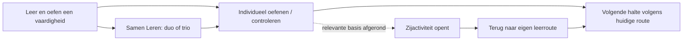

# Rechtenwereld — Samen Leren en activiteiten in de wereld

**Preproductie · momentopname van 29 september 2026.**

De uitvoering is daarna goedgekeurd. Bekijk de [lokale oplevering van 30 september](OPLEVERING.md) voor wat inmiddels werkt, wat getest is en wat nog niet live staat. De onderstaande inventaris en ontwerpopties beschrijven de situatie vóór deze uitvoering.

Dit voorstel combineert de aangeleverde brief over **Samen Leren** met de uitbreiding over bestaande games. Het is gebaseerd op de actuele werkmap, inclusief nog niet gecommitteerde wijzigingen. Er is geen productiecode aangepast, geen database gewijzigd en niets uitgerold. Didactische effecten zijn ontwerpverwachtingen die met leerlingen moeten worden beproefd; er is nog geen klasproef met dit ontwerp gedaan.

**Advies:** bouw Samen Leren als een gedeeld werkbord voor twee of drie leerlingen, met een korte eigen denkstap, één bouwer en gerichte controle door de anderen. Laat bestaande games als zijactiviteiten aansluiten op concrete vaardigheden. Houd de verplichte leerroute volledig solo uitvoerbaar. Een gezamenlijk juist antwoord of gewonnen wedstrijd is geen bewijs dat ieder groepslid de leerstof beheerst.

[Schermschetsen en kaartconcept](./SCHERMEN.svg) · [Bronnen en gecontroleerde bestanden](#bronnen-en-gecontroleerde-bestanden)

## 1. Wat er daadwerkelijk in de repository staat

De actieve map is `games/rechten/rechtenwereld/`. `trainer-v2/` is inmiddels een doorverwijzing; nieuwe aansluitingen horen niet in die oude map.

| Onderdeel | Vastgesteld in de huidige code | Betekenis voor dit ontwerp |
| --- | --- | --- |
| Rechtenwereld | Vijf gebieden, 28 haltes, 21 speelbaar. Puntenbaai 2/2, Hellingrug 5/5, Grenspas 5/5, Formulewerf 8/9, Signaalstad 1/7. | Catalogusinhoud en daadwerkelijk beschikbare werkborden zijn niet hetzelfde. Geen activiteit vergrendelen achter een nog niet speelbare halte. |
| Huidige route | Puntenbaai is optionele voorkennis. Verplichte volgorde: Hellingrug → Grenspas → Formulewerf → Signaalstad. Eerder begonnen gebieden blijven toegankelijk. | Dit voorstel behoudt de volgorde en bestaande toegang. Het herontwerpt niet stilzwijgend het curriculum. |
| Rekenkern | `mission-runtime.js` gebruikt bestaande exacte taak- en validatiemodules; status is serialiseerbaar. Antwoord, feedback, hints, herstel en volgende stap zijn gescheiden. | Goede basis voor een gezamenlijke toestand en servercontrole. |
| Oefenbewijs | `evidence-adapter.js` onderscheidt hulp, eerdere feedback, zelfstandig antwoord en invoerfouten. Het zet bewust `mastery:false`. Kaartvoltooiing is ook mogelijk na herstel. | Niet “afgerond” hernoemen tot “beheerst”. Groepswerk vereist expliciete attributie aan personen. |
| XP | De actuele shell toont `platformXp`; de app berekent wereld-XP. Oudere README-passages die stellen dat er geen XP is, zijn niet overal meer actueel. | Geen extra beloningsformule introduceren. Bestaande en nieuwe beloningen mogen niet dubbel tellen. |
| Lokale Duo Board/Battle | Eén ouderpagina bestuurt twee geïsoleerde `battle-player`-iframes. Zelfde opgave, eerste juiste antwoord wint de ronde; fout antwoord geeft tijdelijk pauze. | Borden en validators hergebruiken; geen twee borden in één smartphone voor online samenwerken. |
| Battlecatalogus | 15 aangeboden vaardigheden. Onder andere `slope_from_two_points`, herschrijven en de langere afleidingsketens ontbreken, hoewel sommige solo al werken. | “Alle solo-opgaven ook samen” is een afzonderlijke adapteruitbreiding, geen bestaande functie. |
| Groepsbattle | Centrale login, leerkracht maakt sessie, code, late deelname vanaf volgende volledige ronde, tijd en inzendingen op de server. De leerkrachtbrowser valideert antwoorden. | Lobby en deelnemersweergave bruikbaar; browserbeoordeling niet overnemen als gezaghebbende bron voor leerlinggestuurde samenwerking. |
| Online Duo | Er staat een nieuw lokaal prototype met SQL-migratie, Edge-handler, gedeelde validatorbundle en tests. Volgens `docs/v10-online-duo.md` nog niet op productie uitgerold. | Bruikbaar vertrekpunt voor servercontrole, revisies, verborgen antwoorden en herstel. Live beschikbaarheid is tijdens deze preproductie niet gecontroleerd. |
| Platform sociaal | `AxiomaSocial` beheert online spelers en duurzame uitnodigingen; polling, tab-identiteit, verlopen uitnodigingen en centrale accounts bestaan. Er zijn aansluitingen voor Zeeslag en het nieuwe Online Duo. | Eén sociaal systeem uitbreiden. De huidige uitnodiging is voor één ontvanger; trio's vragen echte sessieleden. |

**Bestaande afbakening van Online Duo:** competitief, twee leerlingen uit dezelfde klas, taken uit de doorsnede van afgeronde ondersteunde vaardigheden, Puntenbaai uitgesloten, geen battle-XP. Deze voorwaarden zijn niet automatisch geschikt voor Samen Leren: leerlingen moeten daar juist ook leerstof kunnen oefenen die nog niet afgerond is.

## 2. Inventaris: bestaande spellen, inhoud en ontgrendelingen

Onderstaande ontgrendelingen zijn **ontwerpvoorstellen**, geen al aanwezige koppelingen. Ze verwijzen naar concrete vaardigheden, niet naar willekeurige XP-drempels. Een ontgrendelde activiteit blijft open, ook als later herhaling nodig is.

| Activiteit | Wat de leerling werkelijk doet | Logische toegang binnen Rechtenwereld | Als beheersingsbewijs? |
| --- | --- | --- | --- |
| **Kleiduiven / Richtingsveld** | Een helling kiezen bij een bewegend doel op een rechte door de oorsprong, dus `y = ax`. Positieve, negatieve en nulhelling, inclusief breuken. Drie keuzes. Solo zeven richtingen, gemiste richtingen terug; groep zeven juiste op rij. | Na `delta`, `slope` en `line_behavior` in Hellingrug. Niet wachten op Formulewerf: het spel oefent geen vrije y-afsnede. | Optionele toepassing. Snelheid, herkansing en de drie keuzes maken de eindscore ongeschikt als zelfstandig mastery-checkpoint. Wel bruikbare taakobservaties als eerste poging en hulp apart geregistreerd worden. |
| **Brandweerpost — hellingsmissies** | Vanuit een vaste beginhoogte de juiste helling kiezen zodat de ladder/rail het doelpunt bereikt. | Kleine startreeks na dezelfde Hellingrug-basis: bestaande reddingen 1, 4, 5, 9, 12 en 13 hebben `b = 0`. De adapter vult de gegeven b in en vergrendelt die. | Optionele oefenrun van zes reddingen. Een aparte, nieuwe individuele eindvraag kan later bewijs leveren. |
| **Brandweerpost — volledige reddingen** | In zestien bestaande situaties afwisselend a of b bepalen met de andere parameter gegeven; positieve straat en negatieve kloof. In de huidige levels zijn niet beide parameters tegelijk vrij. | Basisvorm en tekenen na `equation_from_ab` en `graph_from_equation`; reddingen met onbekende b na `intercept_from_point`. Niet poorten op `ab` of `intercept` in Signaalstad: die haltes zijn nog previews. | Geschikt voor transferbewijs na toevoeging van individuele voorspelling en registratie van eerste poging/hulp. Een animatie of “gered” alleen is onvoldoende. |
| **Haven — Rechten Zeeslag** | Schepen op coördinaten plaatsen; een rechte `y = ax + b` als schot kiezen; effect van helling en y-afsnede op roosterpunten onderzoeken. Zeven toegestane hellingen en gehele b van −4 tot 4. Verticale rechten vallen buiten deze formulevorm. | Na `slope`, `equation_from_ab`, `graph_from_equation` en `equation_from_graph`. Dat is het relevante Formulewerf-basispakket; de leerling hoeft niet te wachten op alle afleidingen of een context-preview. Coördinatenkennis is nodig, Puntenbaai biedt herstel zonder de hele optionele wereld verplicht te maken. | Optionele toepassing. Een misser kan wiskundig correct maar tactisch ongelukkig zijn; een overwinning bewijst geen mastery. Geen punten geven voor “geraakt” als bewijs van formulebegrip. |
| **Arena — lokale Duo Battle** | Twee leerlingen beantwoorden onafhankelijk dezelfde opgave op hetzelfde toestel; lokaal puntensysteem. | Open na eerste afgeronde ondersteunde vaardigheid. Toon alleen geschikte inhoud; gastmodus laat een bewuste onderwerpkeuze toe. | Wedstrijduitslag niet. Een afzonderlijke eindcheck per aangemelde leerling is denkbaar; twee getypte namen identificeren geen centrale leerlingaccounts. |
| **Arena — Online Duo Battle** | Onafhankelijke antwoorden op twee toestellen; definitief indienen, servercontrole en rondepunten. | Bestaande prototypepool: gezamenlijke afgeronde vaardigheden in toegankelijke werelden. Eerste toegang kan al na een ondersteunde Hellingrug-halte. | De eigen correcte inzending is potentieel bewijs; het winnen niet. Ook een tragere correcte leerling moet hetzelfde wiskundige bewijs krijgen. Nieuwe koppeling nodig. |
| **Klaschallenge / Groepsbattle** | Leerlingen lossen individueel dezelfde opdracht op; docent stuurt rondes, uitslag en ranglijst. | Docent selecteert behandelde vaardigheden. Nog onbekende inhoud alleen expliciet als kennismaking, zonder beheersingsclaim of geforceerde ontgrendeling. | Eigen antwoorden kunnen na betrouwbare servervalidatie meetellen; klasrang en snelheid niet. Huidige docentbrowsercontrole is nog geen serverbewijs. |
| **Meetatelier en functiewerkplaats uit oud Leerpad** | Onder andere verticale functietest, invoer/uitvoer, helling meten, a laten draaien, b verschuiven en een rechte construeren. Er zitten ook eerdere Kleiduiven- en reddingsactiviteiten in. | Hoogstens gerichte uitleg/intermezzo's in Hellingrug, Formulewerf en later Signaalstad. | Bestaande demonstraties en begeleide handelingen niet als individuele mastery. Eerst inhoud en adapter selecteren; niet het hele oude leerpad erbij zetten. |
| **Oude Rechtentrainer** | Meer uitgebreide opgavefamilies, herhaling en historische vaardigheidsgegevens. | Bron voor bestaande generators, feedback en voortgangscompatibiliteit; geen nieuwe attractie op de kaart. | Historische XP blijft historische XP. Geen automatische omzetting naar voltooiing van nieuwe haltes. |

### Passende spelvormen en minimale aanpassingen

“Bestaand” betekent aangetroffen werking in code; het is geen verklaring dat alles opnieuw met echte accounts op productie getest is.

| Activiteit | Solo | Lokaal samen | Online | Klas | Minimaal verbinden |
| --- | --- | --- | --- | --- | --- |
| Kleiduiven | Bestaande zeven-richtingenrun behouden; later rustige variant zonder tijdsdwang. | Om de beurt of coach/schutter kan, maar geen nieuwe splitscreenmodus nodig. Oude Leerpad bevat al coach/schuttertaal. | Geen aparte 1-tegen-1-engine nodig in v1. | Bestaande online groepsrace, ook door leerlingen op te zetten; geen identieke kopie van Groepsbattle. | Wereldingang, terugkeercontext, geschikte pool, runresultaat met eerste pogingen; huidige zeven-op-rij-regel van groepsrace behouden. |
| Brandweer | Bestaande zestien missies; korte selectie van zes als wereldactiviteit. | Plan/controleur is zinvol, maar moet opnieuw aangesloten worden. | Later coöperatieve redding met gedeeld plan; geen snelheidsbattle adviseren. | Docent projecteert, leerlingen voorspellen; geen nieuw klassikaal wedstrijdsysteem in v1. | Kleine selectie-/startadapter, vaste parameter vergrendelen, resultaat met `modeled` en `guided`, terug naar wereld. Coöp later apart. |
| Zeeslag | Bestaand tegen computer, zonder account mogelijk. | Geen gedeeld openbaar bord toevoegen: geheime vloot past daar slecht bij. | Bestaand online 1-tegen-1 hergebruiken. | Niet een volledige vlootwedstrijd als Kahoot herschrijven. | Contextuele haveningang, veilige teruglink, ontgrendeling en passende helpkaart. Volledige partij behouden; een korte schietoefening zou een aparte toekomstige variant zijn. |
| Arena lokaal | Link naar dezelfde vaardigheid in solo. | Bestaande twee borden, vooral tablet/smartboard. | Eigen online variant gebruiken. | Eigen klasvariant gebruiken. | Betekenisvolle inhoudspool, wereldcontext en duidelijke modenaam. |
| Online Duo | Solo-oefenreeks wanneer uitnodigen niet lukt. | Bestaande lokale Arena. | Lokaal voorbereid prototype afwerken/uitrollen, geen tweede duelserver bouwen. | Groepsbattle apart houden. | Uitrol en regressie eerst; daarna gezamenlijke activiteitencatalogus en eventueel bewijsadapter. |
| Samen Leren | Dezelfde taakfamilie zelfstandig met eigen controle. | Later één gedeeld bord met rolwissel; niet doen alsof dit twee afzonderlijke accounts bewijst. | Nieuwe coöperatieve duo- én triomodus. | Docent kan later duo's/trio's samenstellen en helpen. | Zie werkbord-, sessie- en bewijscontract verderop. |

**Brandweer vraagt bijzondere aandacht.** `approvePlan()` kent nog `mode==='together'`, review en een korte bevestigingsvertraging. Maar de huidige instellingen bieden alleen solo, `renderUI()` verbergt de plan- en wisselknoppen en `execute()` accepteert alleen planning. Het oude rollenidee is een waardevol ontwerpvoorbeeld, geen kant-en-klare coöp-engine. Bovendien rapporteert `trackAxiomaLevel()` voltooiing ook na een voorgedane redding: dat label mag niet als onafhankelijk beheersingsbewijs worden geïmporteerd.

## 3. Ritme van de leerwereld

Behoud één hoofdpad. Nieuwe activiteiten zijn uitnodigingen tot toepassen, niet extra verplichte drempels.

Een praktisch ritme is: kennismaking → enkele eigen pogingen → eventueel samen onderzoeken → korte individuele terugblik → verder of een toepassing. Niet na iedere zes vragen verplicht een lobby, checkpoint én wedstrijd. Een leerling kan een hele les solo vooruit, ook als iedereen elders bezig is.

Een activiteit wordt ontsloten wanneer haar inhoudelijke basis is afgerond. Een **checkpoint** gaat over aantoonbaar begrip. Deze twee voorwaarden moeten apart benoemd en opgeslagen worden; de huidige kaart gebruikt voornamelijk voltooiing, niet een nieuw streng masterycriterium.

Bij uiteenlopend niveau kiest Samen Leren een taak waarvoor iedereen de benodigde voorkennis heeft. De taak zelf hoeft nog niet afgerond te zijn. Een gevorderde leerling krijgt geen onbeperkte bediening, maar dezelfde rolrotatie. Bij geen geschikte gemeenschappelijke inhoud: één korte voorgestelde solo-voorbereiding of een docentgekozen kennismakingsopgave. Geen permanente matchblokkade en geen stille ontgrendeling van latere werelden.

## 4. Vier interactiemodellen

| Model | Sterke kanten | Nadelen en risico's | Beste inzet |
| --- | --- | --- | --- |
| **Live bouwen**: één eigenaar, anderen zien wijzigingen | Direct verband tussen handeling en grafiek; weinig schermen. | Sterke leerling kan alles bepalen; meekijken is niet automatisch denken. Gelijktijdig slepen geeft conflicten. | Punt plaatsen, grafiek tekenen, a/b-effect onderzoeken. Alleen met een actieve controletaak voor de anderen. |
| **Eerst zelf, dan vergelijken** | Iedereen heeft een eigen eerste gedachte; verschillen geven aanleiding tot uitleg. | Hele opgave dubbel uitvoeren is traag; drie volledige borden zijn onleesbaar op telefoon. | Meerkeuze, nulwaarde, stijgend/dalend, helling. Toon na onthullen compacte antwoorden, geen drie miniroosters. |
| **Rollen per stap** | Werk wordt concreet verdeeld; past bij afleidingsketens. | Een “uitlegger” zonder eigen handeling kan toeschouwer worden; vaste rollen bevestigen niveauverschillen. | Δx/Δy, hellingbreuk, b afleiden, voorschrift opbouwen. Wissel na een betekenisvolle stap, niet na elke tik. |
| **Hybride**: kort eigen idee → bouwen → gerichte controle | Combineert eigen denken en een gezamenlijke redenering; dezelfde lichte bediening voor duo en trio. | Kan te veel bevestigingen krijgen als elke microstap alle fasen doorloopt. | Aanbevolen basis; taakafhankelijk inkorten. Geen extra formulieren voor communicatie. |

Geen gelijktijdige schrijfrechten op dezelfde oplossing in v1. Twee vingers die onafhankelijk punten verplaatsen leveren vooral onduidelijkheid op. Het bord blijft live in de betekenis van zichtbare, bevestigde veranderingen; tijdens een drag kan de bouwer lokaal vloeiend bewegen.

## 5. Aanbevolen duo- en triowerking

### Duo: bedenken, bouwen, controleren

1. **Eigen idee.** Beiden doen één kleine inhoudelijke handeling: een richting kiezen, een startpunt aangeven of een waarde voorspellen. `Ik weet het nog niet` is een geldig antwoord. Nog geen systeemfeedback en nog geen inzage in het antwoord van de ander.
2. **Vergelijken.** Antwoorden verschijnen bij hetzelfde centrale bord. Bij overeenkomst één korte bevestiging; bij verschil blijft zichtbaar wat verschilt.
3. **Bouwen.** De aangewezen bouwer maakt het gezamenlijke voorstel. De ander kan aanwijzen en een gerichte controle uitvoeren, maar niet tegelijkertijd dezelfde velden wijzigen.
4. **Beoordelen.** De controleur geeft `Akkoord` of `Nog bespreken`. De bouwer bevestigt vervolgens met `Samen controleren`. De server accepteert alleen het voorstel waarvoor beiden akkoord zijn.
5. **Feedback.** Bij een fout volgt een gerichte herstelvraag. Behoud correcte onderdelen zoals de bestaande runtime dat doet. Bij een juist antwoord een korte verklaring, daarna rolwissel.

De eigen denkstap is geen verplichte wachttijd. Geen snelle-leerlingbonus. Voor een kale meerkeuzevraag kan vergelijken direct naar gezamenlijke controle leiden: geen kunstmatige bouwfase ertussen.

### Trio: drie inhoudelijke bijdragen, één bord

Een trio krijgt niet “bouwer + twee mensen die ja klikken”. Gebruik:

- **Bouwer:** maakt het voorstel.
- **Controleur van de stap:** controleert bijvoorbeeld de helling, aftrekvolgorde of gekozen grens.
- **Controleur met een proef:** test bijvoorbeeld een extra punt, een functiewaarde of een waarde links/rechts van de grens.

De labels op het leerlingenscherm zijn concreet: `Jij tekent`, `Controleer de helling`, `Test het punt`. Vermijd een permanent etiket “uitlegger”. Beide controles vragen een eigen getal, keuze of aanwijzing voordat akkoord actief wordt. Een knop indrukken is dus niet de volledige bijdrage.

**Voorbeeld:** bij een gegeven voorschrift bouwt A de rechte, controleert B de start op de y-as en voorspelt C de y-waarde bij een gekozen andere x. Na de opgave schuift iedereen een rol op. Bij drie opgaven is ieder eenmaal bouwer en heeft ieder beide soorten controles gedaan. In een reeks van zes gebeurt dit tweemaal.

Bij meerstapsopgaven mogen rollen per substantiële stap wisselen: A kiest Δx, B kiest Δy, C stelt de verhouding samen; de twee anderen controleren telkens een andere eigenschap. Op een lang voorschrifttraject wordt niet na ieder bouwsteentje gewisseld.

## 6. Mechaniek per opgavetype

| Opgave | Aanbevolen interactie | Actieve derde bijdrage | Hergebruik en grens |
| --- | --- | --- | --- |
| Punt plaatsen (`point_plot`) | Ieder bepaalt kort de richting/het kwadrant; bouwer plaatst P; controle langs assen. | Eén controleert x, één y; controles roteren. | Werkbord aanwezig. Bij aspunten/oorsprong andere controlevraag aanbieden. |
| Coördinaten aflezen (`point`) | Ieder kiest antwoord, dan compacte vergelijking en gezamenlijk besluit. | Ieder onderbouwt een verschillend aspect: volgorde, x of y. | Geen extra bouwfase nodig. |
| Δx / Δy (`delta`) | Richting A→B eerst expliciet; rollen per component. | Verbindt de twee verschillen met de getekende verplaatsing. | Twee inputfasen bestaan. Omgekeerde richting ook mathematisch consequent behandelen. |
| Helling (`slope`) | Eerst individueel kiezen; bouwer maakt verhouding; anderen vergelijken. | Test “bij twee keer zo ver naar rechts, wat gebeurt met Δy?”. | Exacte breuken behouden, verticale breuknotatie. |
| Helling uit twee punten | Rollen per stap: coördinaten, aftrekken, verhouding. | Controleert gelijke aftrekrichting in teller en noemer. | Solo aanwezig; nog niet in huidige BattleGame-pool. Later aparte adapter. |
| Stijgend/dalend/constant | Eerst individueel classificeren, daarna een relevante aanwijzing op de grafiek. | Verifieert effect van toenemende x, niet alleen “pijl omhoog”. | Constante rechte en negatieve coördinaten opnemen. |
| Bijzondere rechten | Eerst zelf classificeren; gezamenlijk onderzoeken. | Controleert of bij één x meer dan één y kan horen. | Verticale rechte, horizontale rechte en samenvallende punten niet op één hoop gooien. |
| Nulwaarde | Eerst zelf de grens bepalen, daarna een leerling markeren en de anderen controleren. | Controle met y=0 of een functiewaarde. | Aflezen en berekenen als afzonderlijke leerdoelen bewaren. |
| Tekenschema / ongelijkheid | Bouwer legt grens; twee anderen testen links en rechts. | Eigen testwaarde en teken; niemand louter tweede stemmer. | Bij f(x)>0 niet “y wordt positief als x positief is” suggereren. Strict versus niet-strict apart. |
| `y = ax + b` bouwen | Eén voorspelt a, één b; bouwer stelt formule samen. | Rekent een controlepunt uit. | Bestaande formulebouwstenen en equivalente antwoorden behouden. |
| Grafiek uit formule | Korte eigen voorspelling; bouwer zet twee punten, anderen controleren start en helling. | Testpunt dat niet samenvalt met een reeds gebouwd punt. | Goede derde v1-familie. Niet automatisch een correct tweede punt voorzeggen. |
| Formule uit grafiek | Ieder eerst a/b aflezen; bouwer formule; gerichte controle. | Controleert voorspelde y bij een andere x. | Leesbare grafiekvariant gebruiken; geen nieuw afleidingsniveau ongemerkt introduceren. |
| Tabel → grafiek | Taken verdelen: twee punten plaatsen en een derde rij testen. | Derde punt/rij controleren. | Alleen opgaven met passende lineaire data; huidige `graph_from_table` bruikbaar na eerste pilot. |
| Formule uit punten/tabel | Rollen per afleidingsstap met een terugblik vóór gezamenlijke check. | Onafhankelijke substitutiecontrole. | Lange ketens bewust buiten minimale v1; solo-modules bestaan gedeeltelijk buiten battlecatalogus. |

Opgaven blijven wiskundig identiek aan de bestaande kern. Controleprompts mogen andere redeneringen vragen, maar bepalen geen concurrerende “eenvoudiger” correctheidsregel. Equivalent geschreven breuken en beide consistente aftrekrichtingen blijven geldig.

## 7. Consensus zonder vastlopen

**V1: 2/2 of 3/3 akkoord voor een gezamenlijke controle.** Geen automatische meerderheid. Eén leerling met een inhoudelijk bezwaar mag niet door de andere twee worden overruled en vervolgens als “heeft het begrepen” worden geregistreerd.

Akkoord hoort bij **opgave + stap + oplossingsrevisie + groepssamenstelling**. Een betekenisvolle wijziging maakt eerdere akkoorden ongeldig. Scrollen, focussen en een pointer verplaatsen doen dat niet.

| Situatie | Reactie |
| --- | --- |
| Twee van drie akkoord | `Nog een vraag van Sara` met haar gekozen aandachtspunt. `Bespreken`, `Wijzigen` of `Denkstap` blijven bereikbaar. Geen rode minderheidsmarkering of aftelling naar gedwongen acceptatie. |
| Per ongeluk akkoord | `Intrekken` zolang de check niet verzonden is. De laatste stem controleert niet automatisch: de bouwer drukt afzonderlijk op `Samen controleren`. Een te laat ingetrokken stem verandert een afgeronde servercheck niet achteraf. |
| Herhaald “niet akkoord” | Toon `Wat wil je nakijken?` met twee of drie inhoudelijke opties. Geen straf. Na twee bespreekrondes bied je hulp, docentondersteuning of individueel verder aan. Twee bespreekrondes zijn een UX-startwaarde, geen harde leernorm. |
| Iemand doet niets | Na circa 30 s zonder betekenisvolle actie een stille herinnering, geen foutscore. Na circa 90 s worden uitwegen duidelijker: vraag hulp, wacht, of ga zelf verder. Online maar stil wordt niet gelijkgesteld aan afwezig. |
| Trio verliest verbinding met één leerling | Korte herstelruimte, bijvoorbeeld 20 s. Daarna mogen de twee aanwezigen expliciet `Verder als duo` bevestigen. Server controleert de ontbrekende heartbeat, wijzigt de samenstelling, verdeelt rollen en vraagt nieuw akkoord. Geen bewijs voor de afwezige leerling. |
| De ontbrekende leerling keert terug | Krijgt de huidige toestand. Na afgesproken vertrek tijdens een taak sluit die weer aan bij de volgende taak; geen rol afpakken midden in een handeling. |
| Duo verliest één leerling | Wachten/herverbinden of zelfstandig verder. Niemand kan zichzelf tot tweekoppige consensus verklaren. |
| Bewust blokkeren terwijl iemand online blijft | Geen automatische wegstemming. Iedere leerling kan stoppen en solo verder; de leerkracht kan later een groep herindelen met zichtbare melding. |

Een docentoverride verandert deelname of biedt hulp; zij vervalst nooit een leerlingstem en levert geen zelfstandig bewijs op. Iedereen kan een lopende groep verlaten. Al bevestigde eigen gegevens blijven behouden; gezamenlijke onafgemaakte redenering wordt niet als individuele prestatie gekopieerd.

## 8. Communicatie: weinig bediening, gericht overleg

**Voor Samen Leren v1:** praten in de klas + `Akkoord`, `Nog bespreken`, `Ik weet het nog niet` en `Kijk hier`. Na `Nog bespreken` verschijnen hoogstens drie taakgebonden keuzes, zoals `Controleer a`, `Controleer b`, `Deze stap snap ik niet`.

Een pointer werkt als een aparte aanwijsstand: tik een getekend punt, een formuleterm of een bordlocatie. Bij anderen verschijnt circa twee seconden een markering met alias/initialen en bijbehorende tekst. Tikken om aan te wijzen mag nooit ook een antwoordpunt verplaatsen. Toetsenbordgebruikers kunnen semantische doelen kiezen zoals “de teller” of “punt B”.

Vrije tekstchat is **niet nodig voor de eerste klasproef**. Op 780×360 verdringt een vaste chatkolom de wiskunde. Voor leerlingen op afstand kan een compacte sessiechat wel nuttig zijn; dat is een latere optie met alleen tekst, ledencontrole, limieten en een duidelijke bewaartermijn. Geen audio/video, bijlagen of klasbrede feed toevoegen.

De eerdere wens voor een algemene privéchat bij **Mijn klassen / Samen spelen** blijft een afzonderlijke platformfunctie. Dit voorstel schrapt die wens niet, maar maakt haar geen voorwaarde om coöperatief te kunnen leren. Een docentenbericht is ook geen automatisch oordeel over beheersing.

Voorgesteld communicatiebeleid voor een pilot: alleen de eigen groep; geen publieke leerlinglijst in het oefenbord; pointers niet bewaren; inhoudelijke akkoord-/controleacties wel bij de taak registreren. Bij latere vrije chat expliciet besluiten wie meldingen kan behandelen en hoelang tekst bewaard wordt. Een “chat” zonder die praktische afspraken niet stilzwijgend uitrollen.

## 9. Smartphone-schermen en bediening

Zie ook [de ontwerpplaat](./SCHERMEN.svg). Dit zijn maat- en flowschetsen, geen reeds geteste implementaties.

**Instap:** gebied/halte → `Samen leren` → kies duo of trio → nodig bekende klasgenoten uit of gebruik een beperkte sessiecode → wachtkamer → ieder `Klaar`. In de wachtkamer staan onderwerp en namen centraal, met `Zelf oefenen` altijd bereikbaar. Geen extra login als het centrale account al actief is. Een gast kan direct solo verder; online deelnemen vraagt het centrale account.

**390×844 portret:** gedeelde topbar, één compacte taakregel met groepsstatus, één werkbord, een korte rolactie onder het bord en een bereikbare primaire knop. Namen in een uitklapbare deelnemerslijst. Eigen ideeën vergelijken via één tijdelijk paneel met twee/drie compacte regels, niet drie borden onder elkaar. Toetsenbord sluiten of een paneel sluiten behoudt alle invoer.

**780×360 landscape, topbar ingeklapt:** linker rail circa 56 px voor herstellen, terug, undo en aanwijzen; rechter rail circa 128 px voor rolactie, akkoord en controleren. Het centrale deel van ongeveer 596 px benut de volledige beschikbare hoogte; de korte vraag staat binnen de eigen bordzone. Geen tweede sessietitel, scorebalk, grote codekaart of instructiebalk boven alles. Namen/verbinding als compacte status in de rail. Bij uitgeklapte topbar neemt het bord de resterende hoogte; er komt geen gameplay-scroll bij.

Bij 640×360 wordt de rechter rail compacter en opent uitgebreidere controle in een tijdelijk paneel. Bij 320 px breedte blijven acties minimaal 44×44. Niet het hele scherm verkleinen tot knoppen en breuken onleesbaar worden. Algemene navigatie of een lange spelerslijst mag scrollen, maar `Controleren`, `Volgende` en herstellen blijven bereikbaar tijdens de opgave.

**Bestaande beperking:** huidige actieve Rechtenwereld-oefeningen zijn vooral ontworpen voor landscape, met minimaal 640×360. Portret ondersteunen vraagt echte aanpassingen aan de geselecteerde werkborden. Voor een pilot is portret geen gratis resultaat van een responsive lobby; het is een aparte acceptatievoorwaarde. Start met punt, Δx/Δy en grafiek uit formule; stel zware formuleketens uit.

Behouden stijl: bestaande wereldillustraties, rustige wiskundeborden, huidige kleuren/lettergebruik, duidelijke rechte panelen en terughoudende randen. Nieuwe sociale bediening krijgt geen afwijkende “chat-app”-identiteit. De bovenbalk blijft inklapbaar, herstel ≥44×44, keuze persistent. Identiteit/XP blijft naast profiel; samenwerking voegt geen verzonnen XP toe.

## 10. Wereldkaart: activiteiten als herkenbare plaatsen

De werkmap heeft nu een hoofdscherm met vijf geïllustreerde wereldpanelen én gebiedskaarten. Behoud die twee niveaus. Bouw niet terug naar een oud screenshot en zet niet alle nieuwe attracties op het hoofdscherm.

- **Hoofdoverzicht:** vijf werelden blijven de belangrijkste bestemmingen. Hoogstens een kleine aanduiding dat in een wereld een nieuwe activiteit is geopend. De hoofdactie blijft `Verder` naar de eigen route.
- **Hellingrug:** een klein richtingsveld langs het leerpad voor Kleiduiven. De eerste hellingsreddingen kunnen via een reddingspost aan de rand van dit gebied vertrekken. Het betreft dezelfde Brandweer-activiteit met een beperkte missiepool, geen tweede spelkopie.
- **Formulewerf:** de Brandweerpost krijgt een uitgebreidere missiekaart. Een haven aan de waterrand opent Zeeslag zodra het relevante basispakket bekend is.
- **Sociale ontmoetingsplek:** één herkenbare aanlegsteiger/arena per relevante gebiedsweergave, gekoppeld aan hetzelfde sociale paneel. Daar staan `Samen leren`, `Duo op één scherm`, `Online duel` en `Met de klas`; geen vier extra eilanden.
- **Signaalstad:** later een meet-/signaalatelier met geselecteerde bestaande demonstraties. Geen nieuwe verplichte plaats voordat de bijbehorende inhoud speelbaar is.

Op een gebiedskaart maximaal twee kleine zijlocaties tegelijk prominent naast de leerhaltes. Meer aanbod staat achter één `Activiteiten`-plaats. Bij kleine schermen kan die plaats een compacte lijst openen. Hotspots minstens 44×44 met echte toegankelijke knoppen boven de illustratie; tekst blijft HTML, niet in een nieuw rasterbeeld gebakken.

Vergrendelde plekken: een rustige bouwplaats/silhouet, nog wel te bekijken. Tik geeft concreet `Oefen eerst helling en stijgen/dalen` plus een routeknop. Niet enkel een slot zonder uitleg. Nieuw geopend: korte niet-blokkerende melding `Nieuwe activiteit: Richtingsveld`, met `Bekijk` en behoud van `Verder`. Melding eenmalig per account/activiteitversie, geen terugkerende popup bij iedere refresh.

Ontgrendeling is afgeleid uit voortgang, niet uit een afzonderlijke kopie van die voortgang. Een latere update sluit reeds bezochte activiteiten niet plots af. Oude spel-URL's en opgeslagen voortgang blijven werken; de nieuwe wereldingangen geven context en terugkeer, maar vereisen geen herschrijving van de spellen.

## 11. Checkpoints: weten wat één leerling beheerst

### Vier verschillende gegevens

1. **Deelgenomen:** was lid en deed mee.
2. **Samen opgelost:** de groep vond een geldige oplossing, eventueel met hulp.
3. **Zelfstandig aangetoond:** deze leerling loste een eigen, nog niet onthulde taak zonder hulp op.
4. **Beheersing bevestigd:** een vast leerdoelbeleid combineert voldoende zelfstandig bewijs en, waar nodig, latere herhaling.

Dit zijn geen vier namen voor hetzelfde vinkje. De huidige “reeks afgerond” blijft bestaan; een groepsantwoord mag niet automatisch in alle persoonlijke missiereeksen als voltooid worden geschreven.

### Gelijkwaardige routes, hetzelfde beoordelingsplan

| Route | Wat kan meetellen | Wat niet |
| --- | --- | --- |
| Solo checkpoint | Eigen nieuwe antwoorden, onafhankelijke controle, variatie en benodigde herhaling. | Alleen het einde van een reeks bereiken na voorzeggen. |
| Samen Leren + eindcheck | Iedere leerling krijgt na de gezamenlijke reeks eigen varianten. Alleen die antwoorden leveren zelfstandig bewijs. | Het gemeenschappelijke eindantwoord of het aantal akkoordknoppen. |
| Online Duel | Individuele, niet onthulde inzending, juiste taakversie en servervalidatie; ontbrekende soorten vragen aanvullen. | Winst, snelste tijd of juistheid geclaimd door een browser. |
| Toepassingsgame | Individuele voorspelling/berekening bij een nieuwe situatie, met hulpmiddelen en eerdere pogingen bekend. | Brandweer-animatie, Zeeslag-treffer of groepsstreak. |
| Klaschallenge | Eigen niet onthulde antwoorden onder hetzelfde beoordelingsplan, na betrouwbare validatie. | Plaats in de ranglijst of docentbrowserresultaat zonder gecontroleerde bewijsroute. |

**Voor de minimale v1:** laat samenwerkingsresultaten oefenbewijs zijn en bied een eigen terugblik aan. Verander nog niet alle routepoorten in nieuwe mastery-checkpoints. Ontwerp een korte checkpointset als pilot, bijvoorbeeld drie nieuwe taken per gekozen vaardigheid met verschillende representaties en één transfer. Dat aantal is een te evalueren voorstel, geen bewezen maatstaf of automatische vervanging van bestaande mastery-/herhaalregels. Mislukte individuele check leidt naar gerichte hulp en een nieuwe variant, nooit terug naar een verplichte multiplayerlobby.

Een gedeeld bewijscontract zou per leerling minstens bevatten: skill-ID, taak-ID en inhoudsversie, activiteit, representatie/variant, antwoordpoging, correctheid, hulp/feedback, zelfstandig of gezamenlijk, tijdstip en validatiebron. Unieke `evidenceId` voorkomt dubbel verwerken na retries. Rol en groepslidmaatschap zijn context, geen vervangende mastery-score. `positive` en `negative` blijven verschillende activiteiten/varianten onder het bestaande skill-ID `sign`.

De centrale reducer bepaalt welke leerdoelen bevestigd zijn. Activiteiten geven observaties door; geen losse `unlockNextWorld=true`-berichtjes. Resultaat-, XP- en deelnameregistratie zijn gescheiden. Eventuele XP komt later via het bestaande beloningsbeleid, één keer per geldige gebeurtenis, niet per toestel of per gezamenlijk akkoord.

Historische Rechtentrainer-XP en lokale herstelgegevens behouden hun eigen betekenis. Verbergen van de oude trainer in het aanbod hoeft het herstelpad niet te verwijderen. De leerkracht kan geen nog uitsluitend lokale browsergegevens van leerlingtoestellen uitlezen; een latere automatische hersteladapter moet op het toestel van de leerling met diens account werken.

## 12. Toestandsmachine van één gezamenlijke taak

```mermaid
stateDiagram-v2
  [*] --> Wachtkamer
  Wachtkamer --> EigenIdee: 2 of 3 leden klaar; taakversie vast
  EigenIdee --> Vergelijken: ieder ingediend of weet_ik_niet
  Vergelijken --> Bouwen: rollen vastgelegd
  Bouwen --> Beoordelen: voorstel opgeslagen
  Beoordelen --> Bouwen: wijzigen / inhoudelijk bezwaar
  Beoordelen --> Controle: alle vereiste akkoorden + expliciete check
  Controle --> Herstellen: fout of inhoudelijke hulp nodig
  Controle --> GezamenlijkKlaar: juist
  Herstellen --> Bouwen: huidige fout bespreken; nieuwe revisie
  GezamenlijkKlaar --> IndividueleCheck: eind van de korte reeks
  GezamenlijkKlaar --> EigenIdee: volgende taak; rollen roteren
  IndividueleCheck --> Afronding: per leerling vastleggen
  Afronding --> [*]
```

Bij een kale keuzevraag kan `Bouwen` één selectie zijn. Bij een lange afleiding herhalen bouwen en beoordelen zich per betekenisvolle stap, zonder elke keer een volledige nieuwe eigen-denkfase.

**Onderbreking is een laag over deze machine:** bij offline/refresh blijft de laatst bevestigde fase staan. Een timeout promoveert een taak nooit naar juist. Wijzigen van groepsleden of editorrol is een servertransactie, verhoogt de revisie en wist relevante akkoorden. Een solo-overstap start een onafhankelijke kopie of passende nieuwe taak met hulpcontext; er wordt geen gezamenlijke goedkeuring geërfd.

## 13. Technisch ontwerp: gericht hergebruik

### Grenzen tussen componenten

| Bestaand onderdeel | Hergebruiken | Toevoegen of aanpassen |
| --- | --- | --- |
| Centrale auth / `AxiomaSocial` | Account, online lijst, uitnodigingennotificatie, accepteren/weigeren, tabbinding. | Nieuwe activiteitssoort en sessielidmaatschap voor max. drie leerlingen. Uitnodigingen verwijzen naar één groepssessie; twee acceptaties mogen niet twee losse duo's maken. |
| `battle-player.html` + app-shell | Geïsoleerd bord, bestaande renderers, invoer en validators. | Een afzonderlijke coöp-adapter: concept laden, bevestigde edits uitsturen, schrijfrecht zetten, aanwijzing tonen, feedback toepassen. Niet de gehele competitieve controller vol extra flags zetten. |
| `mission-runtime.js` en exacte cores | Taakspecificatie, edits, mathematische controle, behouden van correcte deelantwoorden. | Servervriendelijke, allowlisted handelingen per v1-opgavetype; gedeelde revisies buiten de solo-runtime. |
| `BattleGame` / Edge-validatorbundle | Eén bron voor generatie en beoordeling; bewezen patroon van servervalidatie. | Taak-/validatorversie vastzetten, benodigde coöp-fasen exporteren. Niet blind complete runtime-objecten met antwoordmodellen naar clients sturen. |
| Zeeslag realtime | Private kanalen, presence, heldere onderbrekingsmelding, herstelervaring. | Geen peer-to-peer-vlootmodel overnemen. Zeeslag bewaart veel partijtoestand in `sessionStorage`; Samen Leren heeft een duurzaam serversnapshot nodig. |
| Online Duo SQL/worker | Identiteitscontrole, deelnemerchecks, serverfasen, transactiegrenzen en herhaalbare verzoeken. | Een andere coöp-toestandsmachine; geen competitieve deadlines, tegenstanderstatus of vijf-rondenscore als basissemantiek. |
| `storage.js` / voortgang | Eigenaarschap, revisieconflict, offline accountcache en centrale cloudopslag. | Beperkte idempotente bewijsimport. Nooit het hele groepssnapshot over de solostate schrijven. |
| Bestaande games | Bord, artwork, animaties, levels en lokale spelregels. | Gecontroleerde start-/terugkeer-/resultaatadapter. Alleen herbruikbare kern extraheren als echt nodig, geen algemene gameherschrijving. |

### Wie heeft het gezag?

De **server** beheert fase, leden, editorrol, bevestigde oplossing, revisie, akkoorden en definitieve beoordeling. De bouwer bestuurt de invoer, maar is geen host van de waarheid. Als diens laptop uitvalt, blijft de oplossing bestaan.

Voorgestelde gegevens, nog geen schemawijziging: sessie met leden en status; taak met `taskId`, `skillId`, `contentVersion`, seed/variant of bevroren opgave; private eerste ideeën per leerling; gezamenlijk concept met `revision`; rollen en edit-lease; akkoorden bij die revisie; afhandeling/bewijs met unieke sleutel. Eerste ideeën zijn voor anderen verborgen tot de vergelijkfase. Het snapshot voor een leerling bevat geen geheime eerste antwoorden of voorafgaande correcte oplossingen.

Alle handelingen lopen langs account-, lidmaatschap-, fase- en veldvalidatie. `user_id`, `correct` of `xp` uit een clientbericht is geen gezaghebbend gegeven. Mutaties sturen `requestId`, taak/stap-ID en `expectedRevision`; de server vergrendelt de sessie kort en verwerkt dezelfde aanvraag hoogstens één keer. Een verouderde edit krijgt het actuele snapshot terug, geen last-write-wins-verlies. De client serialiseert zijn eigen mutaties.

V1 heeft één editorlease per stap. Een tweede tab kan meekijken maar neemt invoer pas over via `Hier verder`; de server trekt de vorige lease in. Expliciet overdragen bewaart het concept en vraagt opnieuw akkoord. Alleen schermrotatie of inklappen mag nooit een overdracht, taakreset of nieuw bewijs opleveren.

### Wat gaat over het netwerk?

| Gebeurtenis | Opslag / transport |
| --- | --- |
| Definitief punt plaatsen, gekozen antwoord, ingevulde waarde, stap afronden | Authenticated RPC, duurzaam opgeslagen; daarna een melding met nieuwe revisie. |
| Slepen en cursorbeweging | Lokaal animeren. Alleen drag-end opslaan. Eventueel later beperkte previewberichten, zonder statusgevolg. |
| Eigen idee, akkoord, intrekken, controleren, rolwissel | Duurzame RPC met versiecontrole. Akkoord is geen los vluchtig broadcastbericht. |
| Pointer / `Kijk hier` | Tijdelijk privébericht met taak-ID en semantisch doel of bordcoördinaten; max. ongeveer één actieve ping per leerling, circa twee seconden zichtbaar. Niet opslaan als leerprestatie. |
| Serverwijziging | Realtime stuurt een invalidatiesignaal/revisienummer; client haalt het toegestane snapshot op. |
| Presence | Alleen verbindingsindicatie. Aanwezig zijn bewijst geen bijdrage, afwezig lijken wist geen antwoord. |

Een server-ACK van Broadcast bevestigt ontvangst door de realtime-server, niet dat de andere leerlingen het voorstel hebben gezien of dat het als duurzame toestand is opgeslagen. Daarom blijft de RPC/snapshot beslissend. Zie [Supabase Broadcast](https://supabase.com/docs/guides/realtime/broadcast).

Gebruik private kanalen met deelnamecontrole voor lezen en schrijven. Realtime-kanaalrechten worden bij verbinden bepaald; iedere RPC controleert lidmaatschap opnieuw. Bij vertrek sessietoegang intrekken en opnieuw laten autoriseren; vertrouw voor gevoelige antwoorden nooit op alleen een bestaand kanaal. De kanaalmelding bevat daarom geen privé-antwoorden. Pointers volgen een beperkt berichtschema en mogen nooit stemmen, rollen of correctheid wijzigen. Zie [Supabase Realtime Authorization](https://supabase.com/docs/guides/realtime/authorization).

### Refresh, slechte wifi en uitval

1. Na openen/refresh: centraal account controleren, sessie ophalen, taakversie controleren, eigen actuele rol tonen en bevestigd concept toepassen.
2. Niet-bevestigde lokale invoer is zichtbaar als `Nog niet gedeeld`. Een kleine accountgebonden wachtrij mag dezelfde request-ID opnieuw sturen. Bij revisieconflict eerst vergelijken, niet automatisch oud werk overschrijven.
3. Verloren realtimebericht: periodieke snapshotcontrole herstelt verschil. Ontwerpstartpunt: iedere circa 5 s op een actief verbonden bord, tijdelijk circa 2 s bij realtimeproblemen, ruimere interval in achtergrond. Jitter en back-off voorkomen gelijktijdige verzoekpieken van een hele klas.
4. Verbinding weg: laatst bevestigde bord blijft leesbaar; geen nep-succesmelding. Geen eindeloze retrylus voor een inmiddels andere taak of ander account. Gebruiker kan wachten of zelfstandig verder.
5. De server kan benodigde onderbrekings-/leaseovergangen bij het volgende geldige verzoek berekenen. Geen cruciale afhankelijkheid van één hostbrowser of een clienttimer. Een eventuele periodieke opruimtaak is aanvullend.
6. Authwissel/leerkrachtaccount/gast: oude sessiegegevens niet in het nieuwe account tonen. Geen lokaal gastwerk stilzwijgend aan een leerling toeschrijven.

Voor een kleine pilot blijft de sessiesnapshot de primaire implementatie. Geen event-sourcingplatform of continue streams van pointermoves nodig. Pas kanaalfrequentie of databaseontwerp aan op gemeten belasting, niet op een hypothetische massale uitrol.

## 14. Minimale v1 en volgorde

### Stap A — ontwerp beproeven, zonder online backend

Loop met twee duo's en één trio door een klikbare/prototypeversie van de drie gekozen families: punt plaatsen, Δx/Δy en grafiek uit formule. Test of iedereen de eigen rol en de volgende actie begrijpt. Kies zowel 780×360 als gewone portrettelefoons. Het [bijgevoegde schermblad](./SCHERMEN.svg) is de eerste bespreekbasis, nog geen werkend prototype.

### Stap B — eerste bruikbare Samen Leren

- Duo én trio, één taak tegelijk, drie families, zes gezamenlijke opgaven per korte sessie met rolrotatie.
- Centrale accounts, bekende klasgenoten, beperkte code/uitnodigingen. Geen open matchmaking.
- Eigen idee, één bouwer, één of twee inhoudelijke controles, unanimiteit bij actuele revisie.
- Gerichte feedback, pointer en vaste overlegknoppen. Geen vrije chat als afhankelijkheid.
- Serversnapshot, exacte servervalidatie, hervatten en expliciet trio→duo. Gast/geen netwerk/geen partner kan solo starten.
- Eigen terugblik aan het einde. Samenwerkingsbewijs apart; geen automatische mastery- of XP-migratie.
- Deelnemen aan een nieuwe taak pas op een grens tussen taken; geen vierde speler en geen onverwachte late rolwissel.

### Stap C — wereldactiviteiten aansluiten

Eerst de **Richtingsveld-ingang** naar bestaande Kleiduiven en de **Brandweerpost** met zes bestaande hellingsmissies. Daarna volledige reddingen en **Zeeslaghaven** bij de juiste Formulewerf-vaardigheden. De Arena verwijst naar de bestaande lokale/klasmodi en het online duel zodra dat werkelijk operationeel is.

Gedeeld klein aansluitcontract: activiteit-ID, onderwerp/missiepool, solo/sociale vorm, veilige terugbestemming en resultaten met oorsprong. Valideer startparameters tegen een vaste catalogus; een URL-parameter opent niet eigenhandig mastery of latere leerstof. Afsluiten keert terug naar de juiste wereld zonder een nog lopende solo-opgave te overschrijven.

**Buiten v1:** alle 27 skills ombouwen, Brandweer volledig online maken, Zeeslag herschrijven, vrije video/voicechat, openbare ranglijsten voor samenwerken, automatisch docentmatchmaking, nieuwe harde routepoorten en een algemene nieuwe XP-economie.

## 15. Risico's en acceptatiecriteria

| Risico | Maatregel / wat eerst te bewijzen |
| --- | --- |
| Eén leerling doet alles | Eigen denkstap en eigen controlehandeling per taak; rolrotatie. In observaties nagaan of elke leerling de oplossing kan toelichten. Klikactiviteit alleen is geen bewijs. |
| Trio is te traag | Kleine inhoudelijke controles, één bord, geen drie volledige oplossingen kopiëren; rollen per relevante stap. |
| Te veel akkoordschermen | Kale keuzes hebben geen kunstmatige bouwfase; checks alleen per betekenisvol voorstel. |
| Onterechte mastery | Groepsresultaten expliciet ondersteund/samen; alleen eigen nieuwe, gecontroleerde antwoorden naar onafhankelijk bewijs. |
| Bestaande validator verraden via bord | Publieke taakweergave los van antwoordmodel, feedback pas op afgesproken check. Browsercode blijft inspecteerbaar; geen examensecurity claimen. |
| Oudere tab of retry overschrijft concept | Leases, revisies en idempotente requests; test dubbele, vertraagde en verkeerd geordende verzoeken. |
| Lokaal werk verwarren met live functionaliteit | Online Duo-uitrol apart verifiëren; deze preproductie verklaart geen nieuwe backend operationeel. |
| Uitbreiding verstoort goede games | Kleine adapters, spelregels/artwork behouden, afzonderlijke regressiechecks voor Zeeslag, Brandweer en Kleiduiven. |
| Activiteitenkaart wordt een knoppenwand | Hoofdpad vooraan, hoogstens twee zichtbare zijlocaties per gebied en één compacte activiteiteningang. |
| Volgende/terug buiten scherm | Bord en acties op 780×360, 640×360, 390×844 en 320 px controleren, met bovenbalk open/dicht, toetsenbord en 200% tekst waar uitvoerbaar. |
| Bekende oude layoutproblemen | Het Online Duo-rapport meldt een Zeeslag-eindknopprobleem op 844×390. Los dat op vóór promotie van de haven; niet als hier al opgelost presenteren. |
| Oude voortgang verandert | Bestaande accounts, eerder begonnen werelden, XP en herstelkopieën behouden. Geen sociale sessie schrijft hele solo-enveloppen terug. |

Technische acceptatieproeven voor een volgende implementatie: onbekende gebruiker en vierde lid geweigerd; foutieve identiteit/correctheidsclaim genegeerd; eigen ideeën vóór onthullen afgeschermd; akkoord op oude revisie geweigerd; dubbele check geeft één uitkomst; foutieve/fractionele antwoorden via dezelfde kern; refresh in elke fase; wegvallen van bouwer én controleur; trio→duo; reconnect na overdracht; twee tabs; centrale logout; geen multiplayer beschikbaar maar solo volledig bruikbaar. Deze zijn **voorgestelde tests**, niet uitgevoerd op een nog niet bestaande Samen Leren-modus.

Pilotvragen: redeneert iedereen inhoudelijk, begrijpt men het verschil tussen samen klaar en zelf aangetoond, lukt herstellen zonder uitleg door de docent, en blijft de sessie kort genoeg? Registreer wachttijd, overdrachten en technische fouten als diagnose; presenteer ze niet als leerlingcijfers. De docent beoordeelt met een korte individuele terugvraag of een snelle gezamenlijke oplossing ook individueel begrepen is.

## Bronnen en gecontroleerde bestanden

Paden hieronder zijn repositorybronnen, geraadpleegd op 29 september 2026. Aantallen haltes en battlevaardigheden zijn rechtstreeks uit de huidige modules uitgelezen; geen productiegegevens nodig. Oudere README's zijn context, de huidige code is doorslaggevend.

- [Actieve mappen en compatibiliteit](../../games/rechten/README.md).
- [Gebieden, speelbare haltes en ontgrendelingen](../../games/rechten/rechtenwereld/content/area-maps.js).
- [Mission-runtime](../../games/rechten/rechtenwereld/mission-runtime.js), [oefenbewijs](../../games/rechten/rechtenwereld/evidence-adapter.js), [accountopslag en legacy-import](../../games/rechten/rechtenwereld/storage.js).
- [Wereldshell](../../games/rechten/rechtenwereld/components/shell-view.js), [app/wereld-XP](../../games/rechten/rechtenwereld/app-shell.js), [huidige wereldvormgeving](../../games/rechten/rechtenwereld/styles/world-home.css), [gebiedskaartstijl](../../games/rechten/rechtenwereld/styles/area-maps.css).
- [Battlecatalogus en validatie](../../games/rechten/rechtenwereld/battle-config.js), [geïsoleerd werkbordprotocol](../../shared/multiplayer/player.js), [lokale duo-controller](../../shared/multiplayer/duo.js), [klascontroller](../../shared/multiplayer/classroom.js).
- [Zeeslag: solo, realtime en herstel](../../games/rechten/zeeslag/zeeslag.js), [sociale service](../../shared/axioma-social.js), [oorspronkelijke sociale SQL](../../supabase_platform_social.sql).
- [Brandweer: levels, verborgen together-code en rapportage](../../games/rechten/brandweer/index.html): `LEVELS`, `renderUI`, `approvePlan`, `execute`, `trackAxiomaLevel`.
- [Kleiduiven-controller](../../games/rechten/kleiduiven/kleiduiven.js), [exacte vragenbank](../../shared/axioma-clay-questions.js), [groepsservice](../../shared/axioma-groups.js).
- [Oud Leerpad met ateliers](../../games/rechten/leerpad/index.html): `STUDIO`, hellingsmeting, b-verschuiving en coach/schutter.
- [Status en grenzen Online Duo](../v10-online-duo.md), [inhoudspool](../../shared/multiplayer/rechten-online-policy.cjs), [serverhandler](../../supabase/functions/rechten-duo/handler.js), [voorbereide SQL](../../supabase/migrations/20260929235619_rechten_online_duo.sql), [bestaande onlinetests](../../tests/rechten-online.test.cjs).
- Officiële documentatie voor de voorgestelde transportkeuze: [Supabase Broadcast](https://supabase.com/docs/guides/realtime/broadcast) en [Realtime Authorization](https://supabase.com/docs/guides/realtime/authorization). De huidige release-index is betrokken; dit onderzoek voert geen database-upgrade uit.
