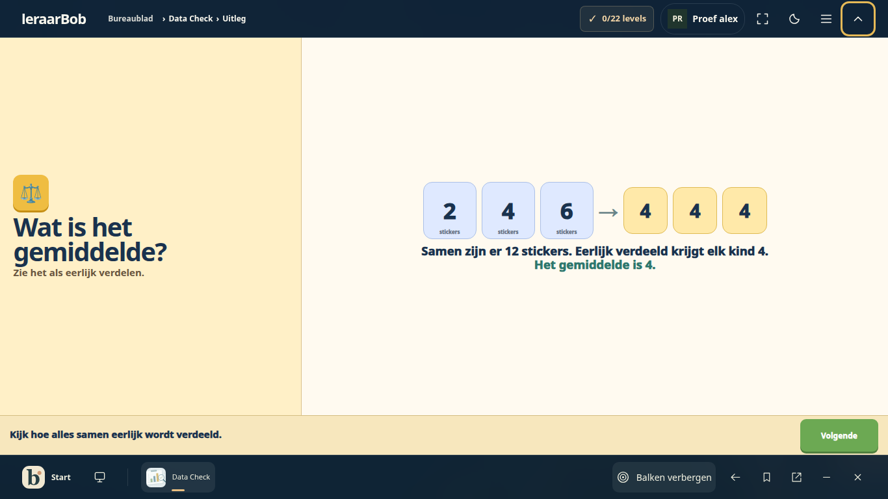
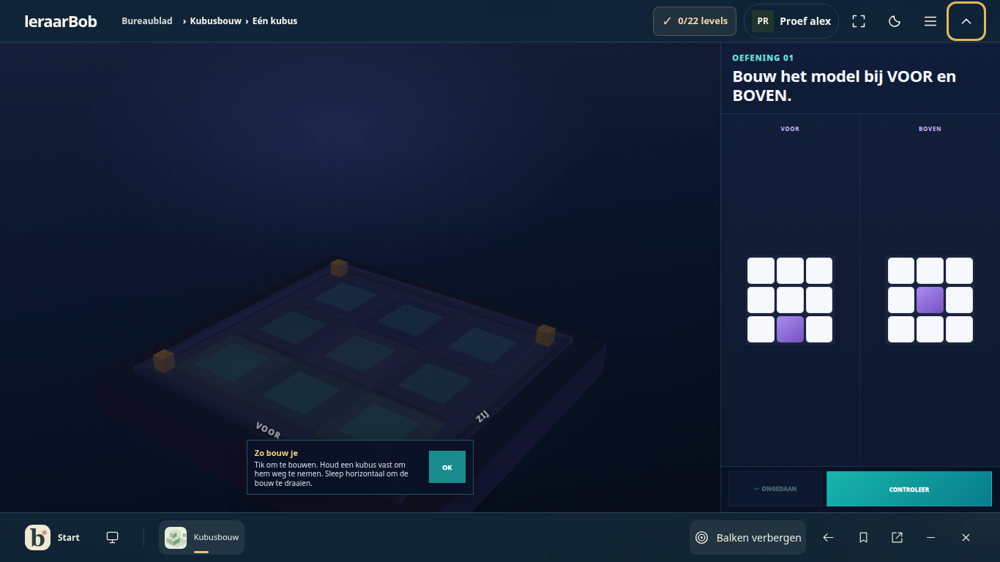
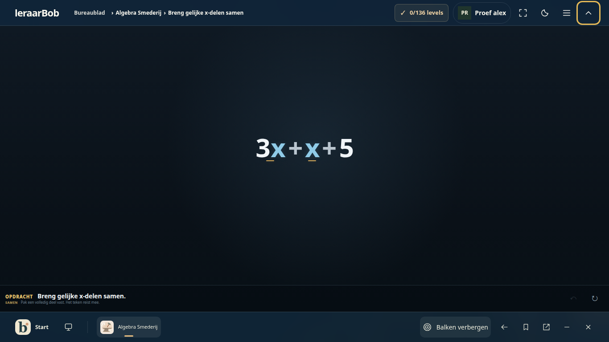
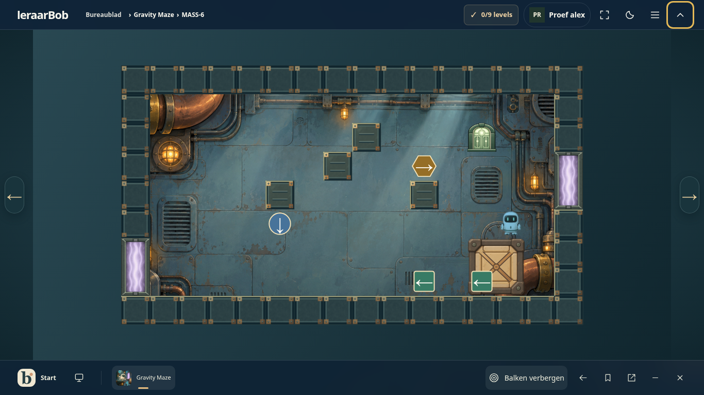
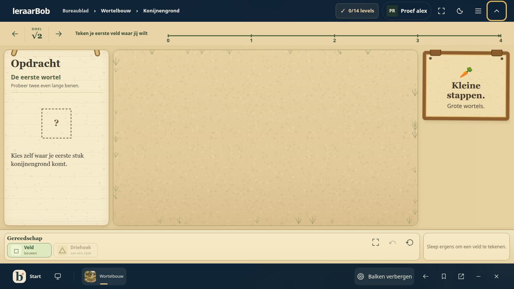
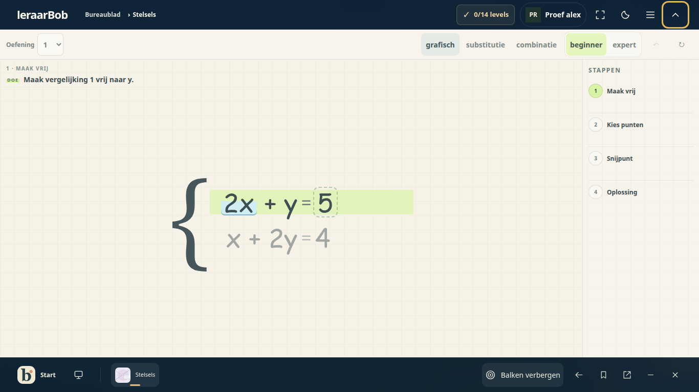
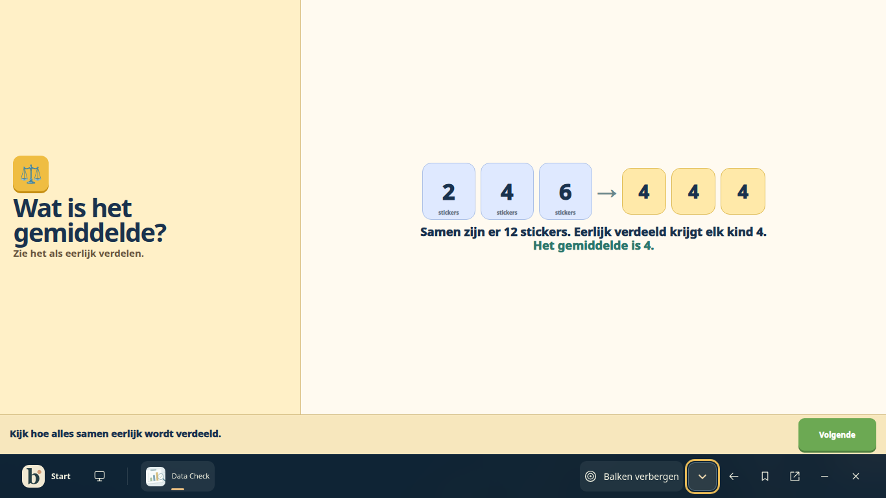
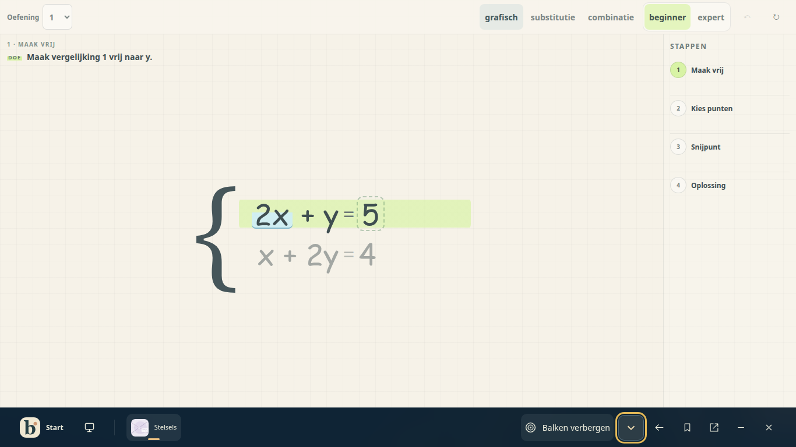

# Uniforme OS-bediening · 10 oktober 2026

Reviewbranch: `codex/os-uniform-game-chrome-20261010`, bovenop Logicawereld (`d6b3bb8`). Lokale ontwikkelpreview: <http://127.0.0.1:8795/os/?previewUser=alex>. Deze preview gebruikt fictieve accounts en een lokale testdatabase.

## Resultaat

De OS-balk beheert navigatie, account, echte spelvoortgang, weergave en volledig scherm. Data Check, Kubusbouw, Gravity Maze, Algebra Smederij en de overige aangesloten spellen tonen geen tweede navigatiekop. Wortelbouw projecteert zijn wereldpad naar de OS-balk. Bij Stelsels blijft de directe oefenbediening zichtbaar: oefening, methode, niveau, ongedaan maken en herstart. Andere noodzakelijke taakgegevens, zoals de bestelling in Verfwinkel en de wortelas in Wortelbouw, blijven bij de oefening.

Het gedeelde menu heeft een sectie **Huidig spel**. Het voert de bestaande native handlers uit en neemt de actuele beschikbaarheid en schakelstand over. Opdracht, invoer, voortgang en iframe blijven behouden bij het bedienen van OS-balken en vensters. Zes native startschermen nemen niet meer automatisch de iframe in fullscreen over; de OS-knop blijft daarvoor beschikbaar.

## Werkelijk uitgevoerd

| Controle | Bewijs | Uitkomst |
| --- | --- | --- |
| Catalogusmatrix | [report.json](report.json) | 25 catalogusitems geïnventariseerd; 24 beschikbare solo-ingangen daadwerkelijk geopend. Rechtenarcade heeft geen geregistreerde solo-ingang en is als groepering overgeslagen. |
| Afmetingen en balken | Zelfde rapport | 1366 × 768, 390 × 844 en 640 × 360, `deviceScaleFactor: 1`, 100% zoom; uitgeklapt en ingeklapt: 144 layouts. 412 metingen van bereikbare doelen van minstens 44 × 44 px. |
| Staat en vensterbediening | Zelfde rapport | Dezelfde native body en formulierwaarden na inklappen, minimaliseren en hervatten. Focus hergebruikt de iframe; de herstel-/sluitstrook staat buiten het werkbord. |
| Echte menuacties | Zeven interactiegroepen in hetzelfde rapport | Data Check: starten en levels. Gravity Maze: bewegen, herstart, kamers en spelregels. Wortelbouw: opgaven. Stelsels: oefening en methode wijzigen, hervatten en onthouden inklapkeuze na OS-herladen. Drie lokale duo-ingangen zonder dubbele navigatie: Rechtenwereld, Vectormissie en Wortelbouw. |
| Rechten-regressie | [rechten-regression.json](rechten-regression.json) | Echte opgave/invoer, wereldpad en voortgangsmenu, Start/focus, beide balkstanden, annuleren en sluiten, hervatten, 1366/390/640 én 320 px. |
| Algebra-regressie | [algebra-regression.json](algebra-regression.json) | 18 groepen, 249 doelmetingen. Zeven Vergelijkingen- en zes Stelsels-levels; echte bewerkingen en zes juiste antwoorden, native 30 XP, hulp/historie, onafgemaakte Stelsels-invoer, centrale oefenbladen, rolgebonden klasingangen, accountwisseling en herladen. Ook zelfstandige Algebra-navigatie gecontroleerd. |
| Werkvormen en lokale sessies | [workforms-regression.json](workforms-regression.json) | 20 groepen, 102 layoutmetingen. Rechten uitnodigen/accepteren/starten/antwoord; Zeeslag intrekken/heruitnodigen/accepteren/beide vlootborden/hervatten; Getallen Learn maken/code/deelnemen/starten/vraag; leerlingdeelname via klascode. Daarnaast 15 afzonderlijke werkvormingangen op desktop en telefoon. |
| DOM- en unitcontroles | [unit-results.txt](unit-results.txt) | 35 tests geslaagd: nodes/handlers, actuele en vervangen knoppen, verborgen schermen, accountrollen, appdekking, vensters, voortgangseenheden, focus en bestaande platformbediening. |
| Bron- en pakketcontrole | `build-catalog.cjs --check`, `desktop-package-check.cjs`, `git diff --check` | Geslaagd. Catalogus/offlinekopie gelijk; 76 bedieningselementen en 20 lokale frontendafhankelijkheden gecontroleerd. |

De definitieve browserruns bevatten geen ongehanteerde browserexceptions of ontbrekende bronnen. [SHA-256 van de relevante bronbestanden](source-hashes.json) koppelt dit bewijs aan de implementatie.

De brede catalogusmatrix controleert telkens het geopende hoofdscherm of de eerste oefening, niet ieder level of elke mogelijke interne spelroute. Bestaande draai-je-toestel-schermen zijn behouden. Productieaanmelding, cloudconflicten en sessies tussen echte externe toestellen zijn niet met deze testaccounts bewezen. De sessieregressie gebruikt lokale providers/database en lokaal realtime-transport; er zijn geen nieuwe multiplayerproviders toegevoegd.

## Screenshots

Selectie uit de definitieve run; de CI bewaart de volledige browseruitvoer als artifact.










## Herhalen

Installeer de testafhankelijkheden zoals beschreven in `.github/workflows/catalog.yml`. Lokaal zijn `playwright`, `jsdom`, `fake-indexeddb` en `@electric-sql/pglite` gebruikt. `LB_CHROMIUM` kan een Chromium-uitvoerbaar bestand aanwijzen; anders kiest de browserproef de beschikbare Brave of Playwright Chromium.

```sh
node --test --test-isolation=none tests/os-native-chrome.test.cjs tests/desktop-dom.test.cjs tests/desktop-model.test.cjs tests/topbar-desktop.test.cjs
CHROME_PROOF=/tmp/chrome-qa node tests/os-native-chrome-browser.cjs
LB_SCREENSHOT_DIR=/tmp/chrome-rights node tests/personal-chrome-browser.cjs
ALGEBRA_OS_SCREENSHOTS=/tmp/chrome-algebra node tests/algebra-os-browser.cjs
WORKFORMS_PROOF=/tmp/chrome-workforms node tests/os-workforms-browser.cjs
node scripts/build-catalog.cjs --check
node tests/desktop-package-check.cjs
```

Aanbevolen volgende stap: de preview beoordelen op de bediening van de eigen klaspraktijk, daarna deze branch samen met haar eerdere OS-basis laten doorstromen naar de publieke versie. De [adapterafspraken](../../NATIVE_CHROME.md) en de nieuwe CI-controles gelden ook voor volgende apps.
